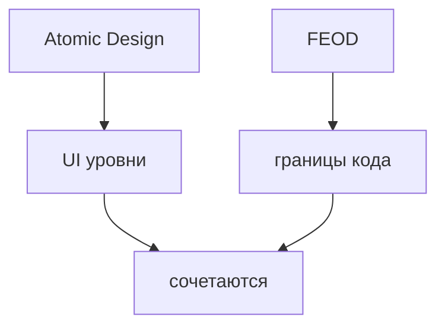

# Сравнение с Atomic Design

Atomic Design и FEOD отвечают на разные вопросы. Atomic Design помогает классифицировать UI-компоненты по уровню композиции. FEOD помогает организовать frontend-код по ответственности, уровням, `public API` и контролируемым зависимостям.



Эти подходы можно сочетать, но нельзя заменять один другим. Atomic Design не отвечает, кто может импортировать модуль, где находится route-level композиция и почему deep import нарушает контракт. FEOD не пытается классифицировать каждый UI-компонент как atom, molecule или organism.

## Короткое сравнение

| Вопрос | Atomic Design | FEOD |
| --- | --- | --- |
| Основной объект | UI-компонент | FEOD-сущность: уровень, модуль, страница, common-элемент |
| Главный критерий | Степень UI-композиции | Ответственность и направление зависимостей |
| Типовая структура | Atoms, molecules, organisms, templates, pages | `app`, `pages`, `modules`, `common`, `global` |
| Что защищает | Единообразие UI-системы | Архитектурные границы и публичные контракты |
| Где особенно полезен | Design system и библиотека компонентов | Приложение с продуктовой логикой и модулями |

## Как подходы сочетаются

Atomic Design может жить внутри UI-библиотеки или `common/ui`, если команда использует такую классификацию для дизайн-системы. FEOD при этом остаётся источником архитектурных границ: где расположен код, кто может его импортировать и через какой контракт он доступен.

Пример допустимого сочетания:

```text
src/
  common/
    ui/
      atoms/
      molecules/
      organisms/
      index.ts
  modules/
    checkout/
      components/
      model/
      index.ts
```

В этом примере Atomic Design помогает организовать общие UI-примитивы, а FEOD отделяет общую UI-библиотеку от продуктового модуля `checkout`.

## Где проходит граница

Если компонент содержит продуктовую ответственность, состояние пользовательского сценария или знание конкретного домена, он не становится `common/ui` только потому, что визуально похож на organism. Его место определяется FEOD-ответственностью.

Например, `CheckoutSummary` с правилами корзины и оплаты должен жить в модуле `checkout` или связанном продуктовом модуле. Общий `Card`, `Button` или `Modal` может жить в `common/ui`, если он не знает о конкретном домене.

## Типовая ошибка

Нарушение:

```text
src/
  atoms/
  molecules/
  organisms/
  templates/
  pages/
```

Такая структура делает Atomic Design верхней архитектурой приложения и теряет FEOD-уровни. По ней нельзя понять, где находится `app`, где продуктовые модули, где общий технический код и какие зависимости разрешены.

## Когда Atomic Design достаточно

Atomic Design может быть достаточен для дизайн-системы или небольшой библиотеки компонентов. Для приложения с маршрутами, продуктовыми сценариями, API-клиентами, состоянием и несколькими командами обычно нужны дополнительные архитектурные границы.

FEOD закрывает именно эту область: структуру приложения и правила взаимодействия между его частями.

## Связанные страницы

- [Common](../structure/common.md)
- [Modules](../structure/modules.md)
- [Где хранить код](../guides/where-to-place-code.md)
- [Code smells](../reference/code-smells.md)
