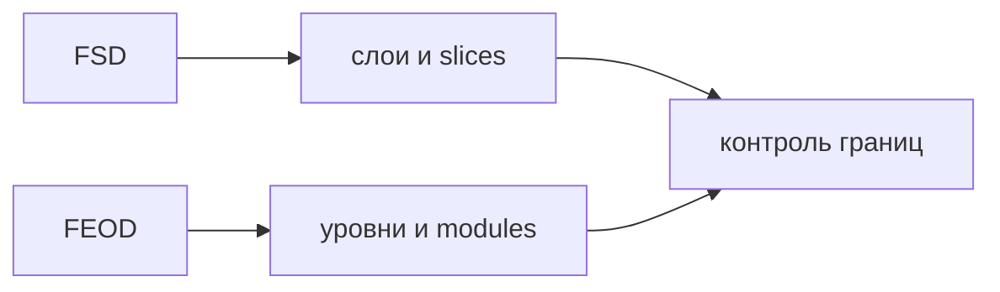

# Сравнение с FSD

FEOD и FSD решают близкую задачу: сделать структуру frontend-проекта понятной, устойчивой и пригодной для командной разработки. Разница в том, как они описывают границы и какой строительный блок делают главным.



FEOD использует уровни `app`, `pages`, `modules`, `common`, `global` и ставит в центр модуль с явным `public API`. FSD использует собственную таксономию слоёв, slices и segments. Поэтому FEOD не является переименованием FSD и не требует переносить FSD-слои внутрь проекта.

## Короткое сравнение

| Вопрос | FSD | FEOD |
| --- | --- | --- |
| Основной язык структуры | Слои, slices, segments | Уровни, модули, FEOD-сущности |
| Главный строительный блок | Slice в рамках слоя | Модуль с ответственностью и `public API` |
| Верхняя структура | Обычно `app`, `pages`, `widgets`, `features`, `entities`, `shared` | `app`, `pages`, `modules`, `common`, `global` |
| Граница переиспользования | Зависит от слоя и публичного API slice | Зависит от уровня и `public API` FEOD-сущности |
| Фокус | Подробная классификация frontend-кода по слоям предметной модели и UI-композиции | Прямой контроль модулей, зависимостей и контрактов |

## Что FEOD упрощает

FEOD уменьшает число верхних категорий. Вместо разделения продуктового кода на несколько FSD-слоёв методология собирает продуктовые ответственности в `modules`.

Это полезно для команд, которым нужен строгий контроль зависимостей, но не нужна постоянная классификация между `entities`, `features` и `widgets`. Спорный код чаще решается вопросом "какая у этого ответственность и какой у него `public API`", а не выбором между несколькими соседними слоями.

## Что FEOD не копирует

FEOD не переносит в себя FSD-слои как обязательную внутреннюю структуру. В FEOD основной термин - "уровень"; "слой" допустим только как пояснение для аудитории, знакомой с FSD.

Нарушение:

```text
src/
  modules/
    entities/
    features/
    widgets/
```

Такой перенос сохраняет FSD как внутреннюю таксономию и делает FEOD внешним переименованием. Если проект мигрирует с FSD, нужно пересобрать ответственность модулей, а не механически вложить старые слои в `modules`.

## Где подходы похожи

Оба подхода ценят явные границы, ограничение зависимостей и публичные точки входа. В обоих случаях deep imports ухудшают сопровождаемость: внешний код начинает зависеть от внутренней структуры, а не от поддерживаемого контракта.

Похожесть целей не означает одинаковость правил. При использовании FEOD источником нормы остаются страницы [Уровни](../core-concepts/levels.md), [Матрица импортов](../reference/import-matrix.md) и [Public API](../reference/public-api.md).

## Когда сравнение полезно

Сравнение с FSD полезно, если команда уже использовала FSD и хочет понять, как перейти на FEOD без потери дисциплины. В таком случае начните с [Миграции с FSD](../guides/migration-from-fsd.md): она переводит старые категории в FEOD-ответственности и показывает, где нужно пересобрать `public API`.

Если команда не использовала FSD, сравнение можно пропустить. Для первого знакомства достаточно [Обзора](../get-started/overview.md) и [Быстрого старта](../get-started/quick-start.md).

## Связанные страницы

- [Миграция с FSD](../guides/migration-from-fsd.md)
- [Термины](../reference/terms.md)
- [Уровни](../core-concepts/levels.md)
- [Матрица импортов](../reference/import-matrix.md)
