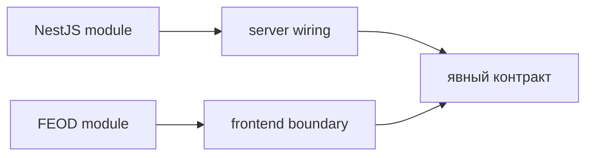

# Сравнение с NestJS-модулями

FEOD-модуль и NestJS-модуль похожи только на уровне общей идеи границы. Оба подхода помогают группировать связанную ответственность и показывать, что доступно наружу. Но NestJS-модуль является runtime-конструкцией backend-фреймворка, а FEOD-модуль является структурной единицей frontend-кодовой базы.



Сравнение полезно для команд, которые привыкли мыслить модулями через `imports`, `providers`, `controllers` и `exports`. В FEOD эти категории не становятся нормой. Методология описывает исходный код frontend-приложения, а не контейнер зависимостей.

## Короткое сравнение

| Вопрос | NestJS-модуль | FEOD-модуль |
| --- | --- | --- |
| Где применяется | Backend-приложение на NestJS | Frontend-приложение независимо от UI-фреймворка |
| Что является модулем | Класс с metadata для DI и runtime-композиции | Директория или FEOD-сущность с ответственностью и `public API` |
| Как задаётся внешний контракт | `exports` в metadata модуля | Корневой `index.ts` или другой явный `public API` |
| Как связываются части | Через DI, providers и module imports | Через TypeScript/JavaScript imports по правилам FEOD |
| Что проверяет подход | Runtime-граф зависимостей NestJS | Структуру исходного кода и архитектурные зависимости |

## Главное отличие

NestJS-модуль участвует в сборке runtime-графа приложения. Он регистрирует providers, controllers, imports и exports, а фреймворк использует эту информацию для dependency injection.

FEOD-модуль не требует DI-контейнера. Его граница выражена файловой структурой, правилами импортов и явным `public API`. Внешний код не должен знать, как модуль устроен внутри, если нужный контракт экспортирован наружу.

## Что можно взять из сравнения

Из NestJS-модулей полезна сама дисциплина контрактов: если часть кода не экспортирована, потребитель не должен использовать её напрямую. В FEOD эта идея выражается через `public API` и запрет deep imports.

При этом FEOD не требует оформлять каждый модуль как сервисный контейнер. Внутри frontend-модуля могут быть компоненты, hooks, stores, API-клиенты, типы и вспомогательные FEOD-сущности. Их конкретный набор зависит от задачи модуля и выбранного frontend-стека.

## Типовая ошибка

Нарушение:

```text
src/
  modules/
    user/
      providers/
      controllers/
      module.ts
      index.ts
```

Такая структура переносит backend-модель в frontend без проверки роли файлов. Если frontend-модулю нужен provider или service, это должно следовать из локальной задачи модуля, а не из попытки повторить NestJS-термины.

## Где живёт wiring

В FEOD верхнеуровневый wiring приложения относится к `app`: роутер, провайдеры, bootstrap, layout shell и интеграции уровня приложения. Модуль может иметь внутреннюю композицию, но он не должен превращаться в глобальный контейнер зависимостей для всего проекта.

Если модуль требует внешних зависимостей, сначала определите его `public API` и границу ответственности. Затем решайте, где эта зависимость подключается: внутри модуля, на странице или в `app`.

## Связанные страницы

- [Modules](../structure/modules.md)
- [App](../structure/app.md)
- [Public API](../reference/public-api.md)
- [Правила зависимостей](../core-concepts/dependency-rules.md)
