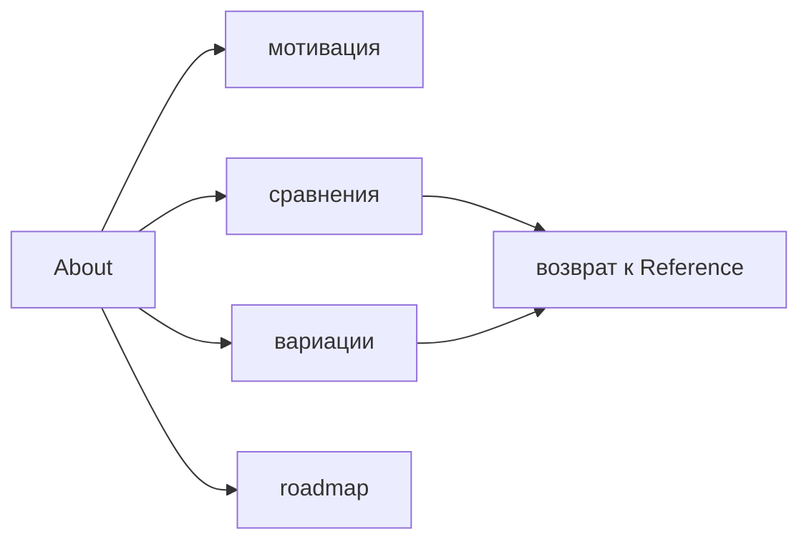

# About

About объясняет, зачем существует FEOD, с чем его сравнивать и куда развивается методология. Этот раздел помогает оценить подход, но не заменяет первый обучающий путь и не является источником нормативных правил.

Если нужно быстро начать, идите через [Обзор](../get-started/overview.md), [Быстрый старт](../get-started/quick-start.md), [Уровни](../core-concepts/levels.md), [Матрицу импортов](../reference/import-matrix.md) и [Public API](../reference/public-api.md).

## Что читать в About

- [Мотивация](./motivation.md) - почему FEOD выделяет уровни, модули, `public API` и контролируемые зависимости.
- [Сравнение с FSD](./comparison-fsd.md) - чем FEOD отличается от FSD и когда сравнение полезно.
- [Сравнение с NestJS-модулями](./comparison-nestjs-modules.md) - почему FEOD-модуль не является runtime DI-модулем.
- [Сравнение с Atomic Design](./comparison-atomic-design.md) - как FEOD соотносится с UI-таксономией компонентов.
- [Вариации FEOD](./variations.md) - какие контролируемые вариации возможны и почему они не заменяют каноническую структуру.
- [Roadmap](./roadmap.md) - какие направления развития есть у документации и tooling без обещания сроков.

## Роль раздела

About отвечает на вопросы оценки:

- почему FEOD нужен как отдельная методология;
- какую проблему решает фиксированная структура `app`, `pages`, `modules`, `common`, `global`;
- чем FEOD отличается от похожих подходов;
- какие решения входят в текущий канон;
- какие направления остаются будущим развитием.

About не хранит матрицу импортов, правила `public API`, glossary, справочник уровней и пошаговые guides. Если сравнительная страница приводит к правилу FEOD, само правило должно жить в `Reference`, `Structure` или `Core Concepts`.

## Когда читать About

Читайте About после базового знакомства с FEOD, если нужно:

- объяснить методологию команде или tech lead;
- сравнить FEOD с уже знакомой архитектурной моделью;
- понять, почему FEOD не копирует FSD, NestJS или Atomic Design;
- оценить будущие направления без смешения roadmap и текущих правил.

Новичку не нужно начинать с About. Первый маршрут должен вести через практический вход, а About подключается тогда, когда нужна мотивация, позиционирование или сравнение.
