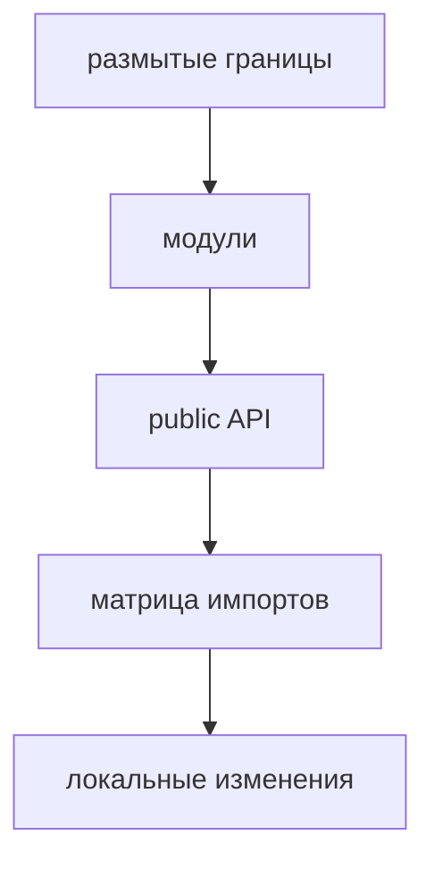

# Мотивация

FEOD появился как ответ на типовую проблему frontend-проектов: структура растёт быстрее, чем команда успевает удерживать границы в устных договорённостях. Папки есть, но по ним не всегда понятно, где бизнесовая ответственность, где общий технический код, где точка сборки приложения и через какой контракт можно использовать соседний модуль.

Методология вводит один стабильный каркас для frontend-приложения: `app`, `pages`, `modules`, `common`, `global`. Этот каркас нужен не ради именования папок, а ради предсказуемых зависимостей и понятной ответственности каждой части проекта.

## Какую проблему решает FEOD

Без явных архитектурных границ проект обычно приходит к одинаковым нарушениям:

- страницы начинают импортировать внутренние файлы модулей;
- модуль становится набором разрозненных компонентов без публичного контракта;
- `common` превращается в место для всего, что сложно классифицировать;
- глобальные декларации и side-effect подключения смешиваются с прикладным кодом;
- новый участник проекта вынужден узнавать правила у команды, а не из структуры.

FEOD делает эти границы видимыми. По расположению FEOD-сущности должно быть понятно, какую роль она играет и кто имеет право её использовать.

## Почему одного деления на модули недостаточно

Обычная модульная архитектура часто фиксирует только идею "разделить проект на части". Она не отвечает достаточно строго на вопросы:

- можно ли импортировать внутренний файл соседнего модуля;
- что считать публичным контрактом модуля;
- где заканчивается модуль и начинается общий технический код;
- где должна жить route-level композиция;
- как повторять структуру внутри крупных модулей.

FEOD добавляет к модульности правила уровней, `public API` и импортов. Модуль остаётся самостоятельной единицей, но его взаимодействие с остальным проектом становится проверяемым.

## Почему `public API` важен

`public API` отделяет поддерживаемый контракт от внутреннего устройства модуля. Внешний код использует модуль через явную точку входа, а модуль может менять приватные файлы без переписывания всех потребителей.

Это снижает связанность. Команда обсуждает не внутреннюю структуру соседнего модуля, а его контракт: что модуль обещает наружу и какие детали остаются приватными.

Подробные правила находятся в [Public API](../reference/public-api.md).

## Почему FEOD фрактален

Фрактальность нужна, чтобы одна и та же логика организации работала на разных масштабах. Проект делится на уровни и модули; крупный модуль может внутри себя выделять подмодули; подмодуль также должен иметь понятную ответственность и границу.

Фрактальность не означает бесконечную вложенность. Она нужна для постепенного роста структуры, когда новая внутренняя область ответственности действительно стала самостоятельной. Подробные ограничения описаны в [Фрактальности](../core-concepts/fractality.md) и [Как работать с подмодулями](../guides/submodules.md).

## Почему FEOD не привязан к фреймворку

FEOD описывает архитектуру frontend-приложения, а не API конкретного UI-фреймворка. Его можно применять в проектах на разных frontend-стеках, если в проекте есть страницы, продуктовые области, общие технические FEOD-сущности и необходимость контролировать зависимости.

Фреймворк влияет на файлы внутри FEOD-сущностей: компоненты, hooks, composables, stores, роутер, провайдеры. Но сами роли уровней и правило доступа через `public API` остаются методологическими, а не framework-specific.

## Когда FEOD особенно полезен

FEOD стоит рассматривать, если:

- проект растёт дольше одного короткого прототипа;
- над кодом работает несколько разработчиков;
- есть повторяемые пользовательские сценарии и продуктовые области;
- команда сталкивается с deep imports и неявными зависимостями;
- onboarding нового участника занимает слишком много устных объяснений;
- архитектурные правила нужно проверять в ревью или будущих инструментах.

Для маленького одноразового прототипа FEOD может быть избыточен. Методология полезна там, где стоимость явных границ ниже стоимости постоянного распутывания связей.

## Связанные страницы

- [Обзор](../get-started/overview.md)
- [Модульность](../core-concepts/modularity.md)
- [Уровни](../core-concepts/levels.md)
- [Матрица импортов](../reference/import-matrix.md)
- [Public API](../reference/public-api.md)
