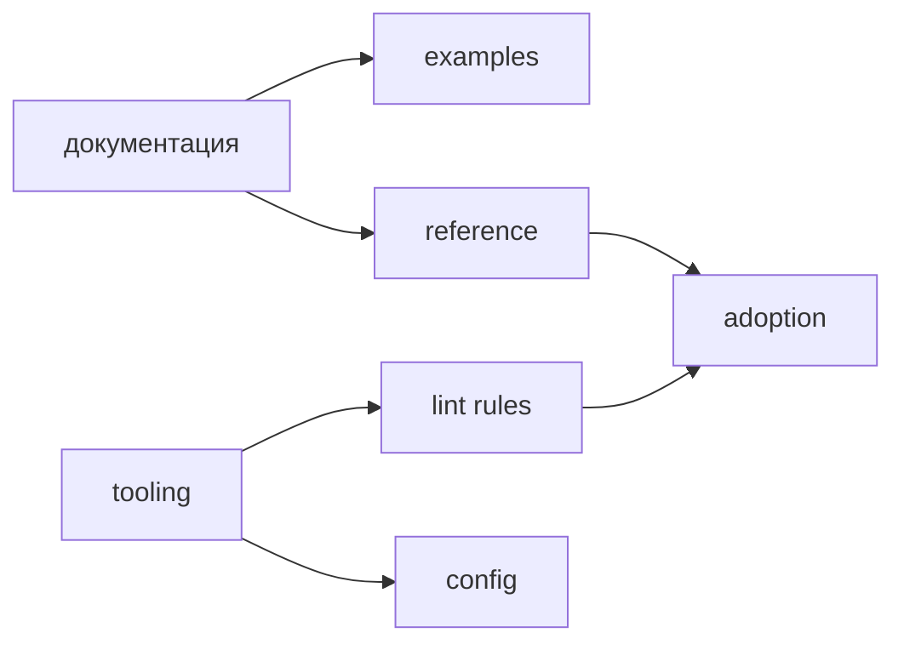

# Roadmap

Roadmap описывает направления развития FEOD-документации и tooling. Он не обещает сроки, готовность инструментов или обязательный порядок поставки. Если направление ещё не подтверждено отдельным артефактом, оно считается будущим развитием.

Источник текущих правил FEOD - `Core Concepts`, `Structure`, `Guides` и `Reference`. Roadmap объясняет, что может быть расширено дальше, но не подменяет нормативные страницы.

## Текущий фокус

Первый этап документации фиксирует каноническое ядро FEOD:

- уровни `app`, `pages`, `modules`, `common`, `global`;
- модульность, фрактальность и сущность-ориентированность;
- `public API` как поддерживаемый контракт FEOD-сущности;
- матрицу импортов и запрет deep imports;
- практические guides по размещению кода, проектированию модулей и миграции;
- примеры проектов разного размера.

Задача этого этапа - уменьшить неоднозначность. Документация должна быть полезна без обязательного tooling и без привязки к конкретному frontend-фреймворку.

## Направления развития документации

Следующие направления могут расширять документацию после стабилизации базового ядра:

| Направление | Что должно дать |
| --- | --- |
| Tutorial-путь | Связные сценарии: новый проект, существующий проект, первый модуль, пошаговая миграция. |
| Больше примеров | Реалистичные проекты с разными типами модулей, страниц и `common`-сущностей. |
| Расширенные guides | Материалы про SSR, BFF, микрофронтенды и сложные integration boundaries после базовых правил. |
| Review checklist | Проверяемые списки для архитектурного ревью FEOD-проектов. |
| Migration stories | Разборы перехода с FSD, обычной модульной архитектуры и component-first структур. |

Advanced-темы не должны попадать в первый обучающий путь. Они становятся полезными только после того, как читатель понимает уровни, `public API` и матрицу импортов.

## Направления tooling

Tooling остаётся вторичным по отношению к методологии. На первом этапе можно описывать только направления, закреплённые в PRD:

| Направление | Роль |
| --- | --- |
| ESLint plugin | Проверять архитектурные нарушения: deep imports, обратные зависимости, обход `public API`. |
| AI rules | Передавать AI-ассистентам правила структуры проекта, генерации кода и ревью. |
| FEOD config | Фиксировать уровни, модули и допустимые отклонения как машинно-читаемый контракт. |

Если техническая реализация инструмента не подтверждена, страница должна описывать продуктовый сценарий или roadmap, а не готовый продукт.

## Что не входит в первый этап

Следующие темы сознательно отложены:

- отдельная английская версия документации;
- отдельные редакции FEOD под React, Vue, Nuxt, Next или Svelte;
- несколько равноправных канонических вариантов FEOD;
- обещание готовых инструментов без подтверждённой реализации;
- позиционирование FEOD как универсальной архитектуры для backend или любых программных систем.

FEOD остаётся framework-agnostic методологией для frontend-приложений. Расширения возможны позже, но они не должны размывать текущий канон.

## Как читать roadmap

Roadmap нужен для понимания направления, а не для проверки правил. Если вам нужно принять архитектурное решение в проекте, используйте:

- [Матрицу импортов](../reference/import-matrix.md);
- [Public API](../reference/public-api.md);
- [Уровни](../core-concepts/levels.md);
- [Где хранить код](../guides/where-to-place-code.md);
- [Code smells](../reference/code-smells.md).
