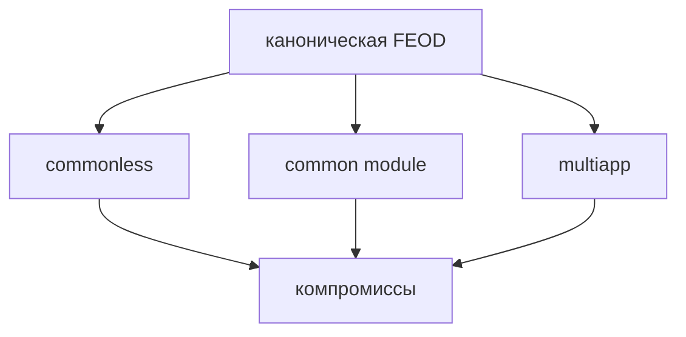

# Вариации FEOD

Эта страница описывает контролируемые отклонения от канонической структуры FEOD. Они нужны не для первого знакомства с методологией, а для проектов, где базовая структура уже понятна и есть конкретная причина изменить её.

Каноническая структура FEOD остаётся прежней: `app`, `pages`, `modules`, `common`, `global`. Если проект выбирает вариацию, он должен зафиксировать её как архитектурное решение и явно описать, какие правила импорта и `public API` меняются.



## Когда рассматривать вариацию

Вариация допустима только если базовое правило создаёт устойчивую операционную проблему, а не потому что команде хочется меньше дисциплины.

| Ситуация | Возможная вариация | Что проверить сначала |
| --- | --- | --- |
| Проект небольшой, а граница `common` постоянно спорная | Commonless FEOD | Нет ли преждевременного выноса кода из модулей |
| Нужен единый модульный контракт для общего технического кода | Common Module | Не превращается ли `common` в продуктовый модуль |
| Одна кодовая база собирает несколько приложений | Multiapp | Можно ли оставить один тонкий `app` и разделить только entrypoints |

Если проект ещё не стабилизировал уровни, `public API` и матрицу импортов, вариацию лучше отложить.

## Commonless FEOD

Commonless FEOD - это вариант без верхнего уровня `common`. Сущности, которые в канонической FEOD жили бы в `common`, размещаются в `modules` как технические или инфраструктурные модули.

Пример:

```text
src/
  app/
  pages/
  modules/
    ui/
    date/
    string/
    auth/
    checkout/
  global/
```

Этот вариант может подойти небольшому проекту, где отдельный `common` создаёт больше споров, чем пользы. Он снижает стоимость вопроса "это уже common или ещё модуль?", но переносит нагрузку на правила проектирования модулей.

### Что даёт

- Меньше решений о границе между `common` и `modules`.
- Технические сущности получают тот же `public API`, что и остальные модули.
- Проще перемещать код между техническими и продуктовыми модулями через единый контракт.

### Риски

- Список модулей быстрее растёт и хуже сканируется.
- Технические и продуктовые модули начинают выглядеть одинаково, хотя несут разную ответственность.
- Связи между модулями становятся плотнее, если команда перестаёт проверять назначение каждой сущности.

### Правила применения

Создавайте новую сущность как подмодуль или часть существующего модуля, если у неё ещё нет самостоятельной ответственности. Не поднимайте каждый helper в отдельный модуль.

Группируйте технический код по смыслу, а не по общему контейнеру. `date`, `string`, `ui` лучше, чем `utilities`, `helpers`, `types` или `constants`.

Не создавайте псевдо-`common` внутри `modules`. Модуль `utilities` с разнородными функциями повторяет проблему `common`, но хуже объясняет ответственность.

Исключение допустимо для действительно технических utility types: `Flatten<T>`, `Either<L, R>`, `Brand<T, Name>`. Типы предметной области должны оставаться в модуле, которому принадлежит эта область.

## Common Module

Common Module - это гибридный вариант, где `common` рассматривается как отдельный модуль с `public API`, а не как самостоятельный верхний уровень.

Пример:

```text
src/
  app/
  pages/
  modules/
    common/
      index.ts
      ui/
      date/
      string/
    auth/
    checkout/
  global/
```

Этот вариант полезен, если tooling, aliases или внутренняя политика проекта требуют одинакового модульного контракта для всех импортируемых FEOD-сущностей.

### Что даёт

- У общего технического кода появляется единая точка `public API`.
- Верхний уровень проекта остаётся короче: `common` не конкурирует с `modules`.
- Импорты можно централизовать через один контракт, если проекту это важно.

### Риски

- Назначение `modules/common` легко становится нечётким.
- `public API` общего модуля часто меняется из-за большого числа потребителей.
- Появляется соблазн разрешить общему модулю импортировать продуктовые модули.

### Правила применения

Сохраняйте дисциплину канонического `common`: внутри общего модуля не должно быть бизнес-логики, сценарного состояния и API конкретного продукта.

Не разрешайте `modules/common` зависеть от продуктовых модулей. Если общий модуль импортирует `auth`, `user` или `checkout`, он перестаёт быть общим техническим контрактом.

Разбивайте крупный `public API` на говорящие подконтракты, если один корневой импорт становится шумным:

```ts
import { Button } from "@/modules/common/ui";
import { formatDate } from "@/modules/common/date";
```

Такой импорт допустим только если `ui` и `date` являются публичными подконтрактами общего модуля, а не deep imports во внутреннюю структуру.

## Multiapp

Multiapp - это вариант для монорепозитория или одной frontend-кодовой базы, из которой собирается несколько приложений. В этом случае верхний `app` превращается в `apps`, а общие `pages`, `modules`, `common` и `global` остаются на верхнем уровне.

Пример:

```text
src/
  apps/
    main-site/
      app/
      pages/
      modules/
      global/
    commercial-landing/
      app/
      pages/
    electron-app/
      app/
  pages/
  modules/
  common/
  global/
```

Локальные `pages`, `modules` и `global` внутри конкретного приложения принадлежат только этому приложению. Когда сущность становится полезной нескольким приложениям, её можно поднять на общий верхний уровень.

### Что даёт

- Несколько приложений используют один набор общих модулей и страниц.
- У каждого приложения остаётся место для приватной композиции, entrypoints и интеграций.
- Код можно постепенно поднимать из приватной области приложения в общую область без смены методологии.

### Риски

- `apps` может превратиться во второй проектный корень с собственными скрытыми правилами.
- Общие `pages` могут начать зависеть от деталей конкретного приложения.
- Приватные модули легко забыть поднять наверх, когда они стали общими.

### Правила применения

Держите `app` внутри каждого приложения тонким. Он отвечает за запуск, провайдеры, роутинг и wiring, но не хранит бизнес-логику.

Разделяйте приватные и общие сущности по фактическим потребителям. Если модуль нужен только `electron-app`, он остаётся внутри `apps/electron-app/modules`. Если его используют два приложения, он переезжает в верхний `modules`.

Не позволяйте общим `modules` импортировать код из `apps/*`. Зависимость должна идти от приложения к общим страницам, модулям и `common`, а не обратно.

## Как зафиксировать вариацию

Проект, который выбирает вариацию FEOD, должен описать её в архитектурном решении или README:

- название вариации;
- какие уровни меняются;
- какие правила импортов остаются каноническими;
- какие исключения разрешены;
- как вариация отражается в aliases, lint rules и FEOD config;
- когда решение нужно пересмотреть.

Без такой фиксации вариация превращается в неявное исключение. Это хуже, чем каноническая структура, потому что команда теряет общий язык проверки.

## Связанные страницы

- [Уровни](../core-concepts/levels.md)
- [Матрица импортов](../reference/import-matrix.md)
- [Public API](../reference/public-api.md)
- [Как не превратить common в свалку](../guides/common-boundaries.md)
- [FEOD config](../tools/feod-config.md)
