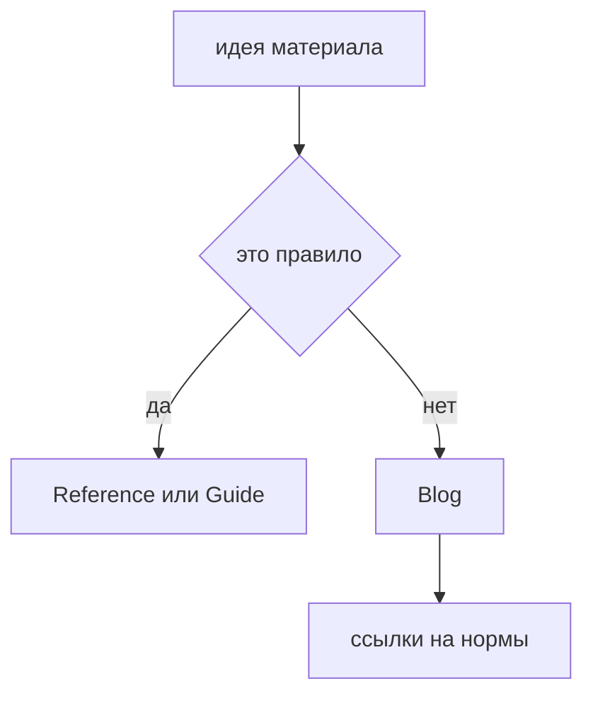

# Blog

Blog нужен для контекста, историй и обсуждения архитектурных решений. Он не является нормативной частью документации и не должен подменять `Docs`.

## Что можно публиковать

В Blog подходят материалы, которым нужен авторский контекст:

- почему появился FEOD;
- реальные истории миграции;
- сравнение подходов;
- архитектурные ошибки на проектах;
- trade-offs и спорные вопросы;
- заметки о развитии инструментов.

## Что нельзя выносить в Blog

Следующие материалы должны жить в `Docs`, а не в Blog:

- матрица импортов;
- правила public API;
- определения терминов;
- glossary;
- правила уровней;
- правила именования;
- code smells как нормативный список.

Если статья объясняет правило, она должна ссылаться на соответствующую страницу `Reference`. Читатель не должен искать норму в длинной статье.

## Редакторское правило

Blog может быть более живым по тону, чем reference-раздел, но он не должен спорить с нормативной документацией. Если статья предлагает исключение, исключение должно быть описано как контекстный trade-off, а не как новая общая норма.

## Связанные разделы

- [Матрица импортов](../reference/import-matrix.md)
- [Public API](../reference/public-api.md)
- [Code smells](../reference/code-smells.md)
- [Где хранить код](../guides/where-to-place-code.md)
