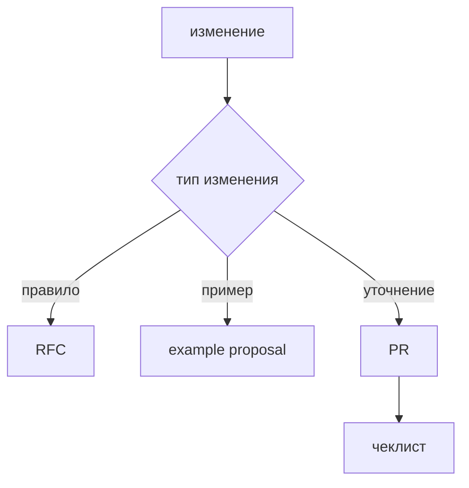

# Как участвовать

Этот раздел описывает вклад в документацию FEOD. Нормативные правила методологии меняются через явные предложения, а не через случайные правки текста.

## Что можно предлагать

- исправления неточных формулировок;
- новые good/bad examples;
- новые tutorial-сценарии;
- framework appendices;
- уточнения glossary;
- предложения для tooling-страниц.

## Что требует обсуждения

Отдельного обсуждения требуют:

- изменение матрицы импортов;
- изменение канонических уровней;
- новое исключение из public API;
- новая трактовка `common` или `global`;
- перенос нормативного правила из Reference в Blog или Community.

## Как готовить изменение

1. Определите тип страницы: onboarding, tutorial, guide, reference, tools или community.
2. Проверьте связанные страницы, чтобы не создать дубль.
3. Добавьте good/bad example, если изменение касается правила.
4. Проверьте ссылки на существующие `.md` страницы.
5. Запустите docs build и docs check.

## Чеклист

- Изменение не противоречит [Матрице импортов](../reference/import-matrix.md).
- Термины совпадают с [Терминами](../reference/terms.md).
- Новый материал не создаёт раздел `Прочее`.
- About-материалы не смешаны с tutorial или reference.
- Если правило спорное, есть раздел `Почему` или ссылка на нормативную страницу.

## Связанные страницы

- [RFC process](./rfc-process.md)
- [Как предлагать examples](./examples.md)
- [Исключения из правил](./exceptions.md)
