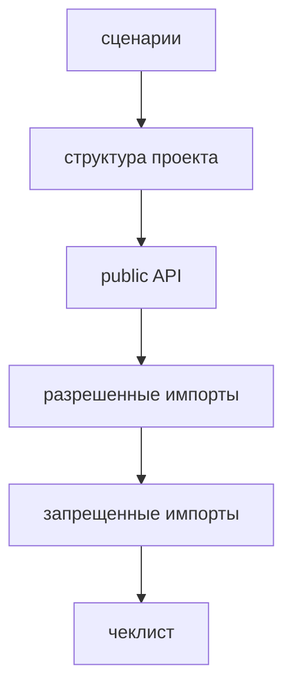

# Как предлагать examples

Examples должны показывать применение FEOD на реалистичных сценариях. Они не заменяют reference и не вводят новые правила.



## Требования к example

Хороший example содержит:

- цель примера;
- пользовательские сценарии;
- дерево проекта;
- public API ключевых модулей;
- разрешённые импорты;
- запрещённые импорты;
- чеклист проверки;
- ссылки на reference.

## Минимальная структура

```md
# Example: <название>

## Цель примера

## Сценарии

## Структура проекта

## Public API модулей

## Разрешённые импорты

## Запрещённые импорты

## Чеклист примера
```

## Good example

Example показывает, почему `checkout` импортирует `cart` через public API:

```ts
import { useCart } from '@/modules/cart';
```

Затем показывает нарушение:

```ts
import { cartStore } from '@/modules/cart/model/cart-store';
```

Нарушение: example фиксирует границу правила на конкретном сценарии.

## Bad example

Example содержит только большое дерево файлов без объяснения сценария.

Нарушение: читатель видит структуру, но не понимает, почему границы проведены именно так.

## Чеклист

- Example связан с реальным пользовательским сценарием.
- В нём есть минимум один public API.
- В нём есть good/bad imports.
- Он ссылается на `Reference`, если показывает правило.
- Он не создаёт новую норму вне reference-страниц.

## Связанные страницы

- [Минимальный SPA](../examples/minimal-spa.md)
- [E-commerce](../examples/ecommerce.md)
- [Dashboard / Admin Panel](../examples/dashboard-admin.md)
