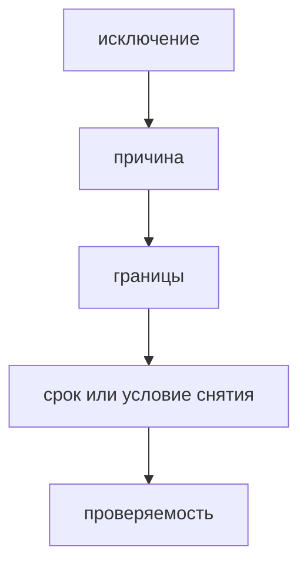

# Исключения из правил

Исключение в FEOD - это явное локальное отклонение от правила с причиной и границами. Исключение не должно становиться скрытой новой нормой.



## Когда обсуждать исключение

Обсуждение нужно, если изменение:

- нарушает матрицу импортов;
- открывает внутренний файл модуля внешним потребителям;
- помещает доменный код в `common`;
- использует `global` как shared;
- меняет canonical-структуру проекта.

## Формат исключения

```md
## Исключение: <короткое название>

- Правило: <какое правило нарушается>
- Область: <файлы, модуль или команда>
- Причина: <почему правило нельзя соблюсти сейчас>
- Срок или условие пересмотра: <когда вернуться>
- Владелец: <кто отвечает за удаление или продление>
```

## Good example

```md
## Исключение: legacy cart imports

- Правило: no deep imports from modules
- Область: `src/pages/legacy-cart/**`
- Причина: страница мигрируется отдельно от модуля `cart`
- Условие пересмотра: после появления `modules/cart/index.ts`
- Владелец: cart team
```

Исключение ограничено и связано с миграцией.

## Bad example

```md
Разрешаем deep imports, если так быстрее.
```

Нарушение: нет области, причины, срока пересмотра и владельца.

## Чеклист

- Исключение ссылается на конкретное правило.
- Область исключения ограничена.
- Причина проверяема.
- Есть условие пересмотра.
- Исключение не скрыто внутри Blog или Community как новая норма.

## Связанные страницы

- [Матрица импортов](../reference/import-matrix.md)
- [Code smells](../reference/code-smells.md)
- [RFC process](./rfc-process.md)
