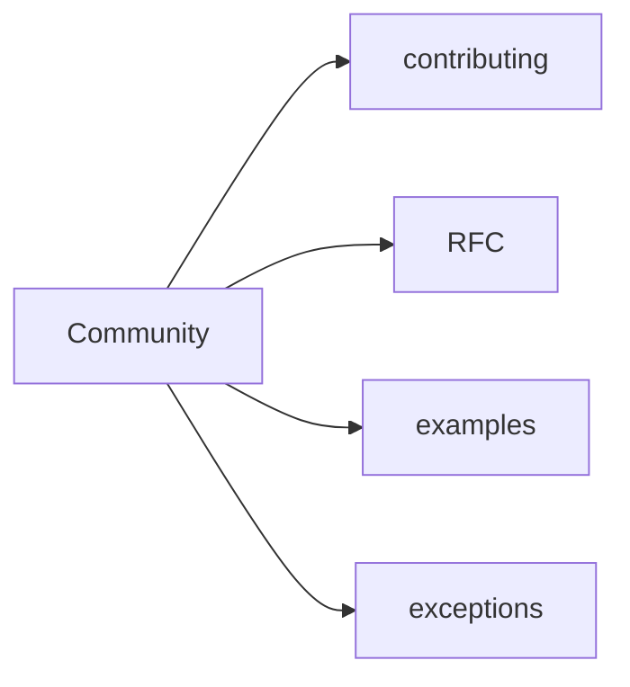

# Community

Этот раздел хранит материалы сообщества: участие, RFC, предложения examples и обсуждение исключений из правил FEOD.

На текущем этапе здесь нет нормативных правил. Если материал задаёт правило методологии, он должен находиться в `Docs` или `Reference`, а не в `Community`.

## Материалы

- [Как участвовать](./contributing.md)
- [RFC process](./rfc-process.md)
- [Как предлагать examples](./examples.md)
- [Исключения из правил](./exceptions.md)

## Связанные страницы

- [Обзор](../get-started/overview.md)
- [About](../about/index.md)
- [Tools](../tools/index.md)
