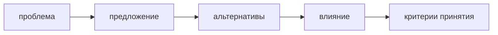

# RFC process

RFC нужен для изменений, которые меняют правила FEOD, структуру документации или поведение будущих инструментов.



## Когда нужен RFC

RFC нужен, если предложение:

- меняет матрицу импортов;
- добавляет или убирает верхний уровень;
- меняет определение public API;
- вводит новое правило для `common` или `global`;
- добавляет обязательное требование к tooling;
- меняет целевую информационную архитектуру.

## Формат RFC

```md
# RFC: <название>

## Проблема

<какую неоднозначность или боль решаем>

## Предложение

<что меняется>

## Альтернативы

<какие варианты рассматривались>

## Влияние на документацию

<какие страницы нужно изменить>

## Влияние на tooling

<что меняется для lint rules, AI rules или config>
```

## Критерии принятия

- Предложение не ломает базовый путь обучения без необходимости.
- Reference остаётся строгим источником правил.
- Изменение имеет good/bad examples.
- Tooling impact описан явно.
- Исключения имеют границы применимости.

## Что не является RFC

Не нужен RFC для:

- исправления опечатки;
- добавления ссылки на уже существующее правило;
- уточнения примера без изменения нормы;
- добавления нового framework appendix, если он не меняет базовые правила.

## Связанные страницы

- [Как участвовать](./contributing.md)
- [Исключения из правил](./exceptions.md)
- [FEOD config](../tools/feod-config.md)
