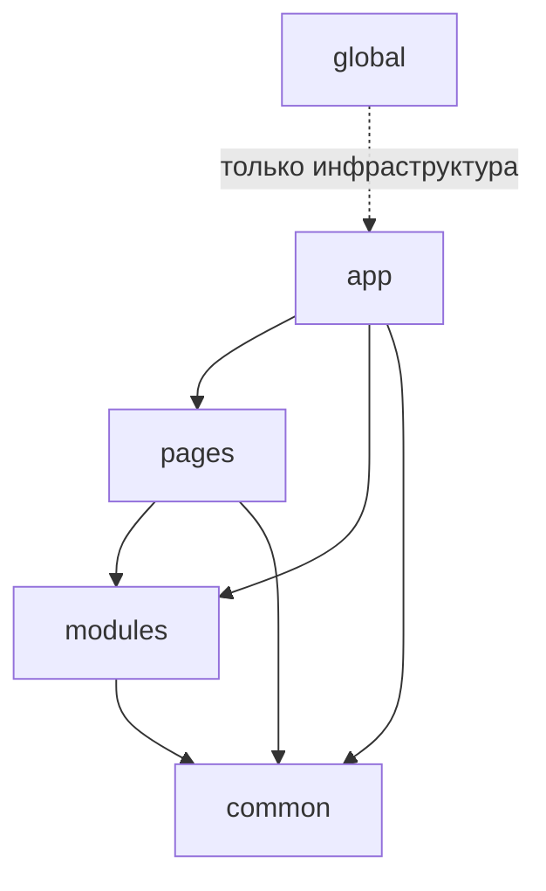

# Правила зависимостей



## Короткое определение

Правила зависимостей FEOD определяют, в какую сторону могут идти импорты, через какие контракты разрешено связывать уровни и почему внутренние файлы нельзя импортировать напрямую.

## Какую проблему решает

Без явных правил зависимостей структура быстро перестаёт быть проверяемой. Модули начинают протекать внутренностями наружу, `common` тянет продуктовый код, а `global` превращается в скрытый API.

## Правило

Зависимость в FEOD всегда читается по импорту: если `A` импортирует `B`, то `A` зависит от `B`. Разрешены только те зависимости, которые указаны в матрице импортов, а доступ к чужой FEOD-сущности идёт только через её public API.

## Почему

Это делает архитектуру проверяемой и локализует изменения. Если зависимость не проходит через явный контракт, невозможно надёжно понять, что именно считается поддерживаемым интерфейсом, а что является деталью реализации.

## Направление зависимостей

Направление зависимости совпадает с направлением импорта.

```text
A -> B
```

Это означает:

- `A` импортирует `B`;
- `A` зависит от `B`;
- `A` использует `B`.

Обратная формулировка вроде "`B` используется из `A`" не меняет направление зависимости. Например, если страницы используют модули, это означает, что `pages` импортируют `modules`, а не наоборот.

## Нормативные правила

1. Код на каждом уровне должен импортировать только те уровни, которые разрешены матрицей импортов.
2. Внешний импорт FEOD-сущности должен идти через её public API.
3. Deep imports во внутренние файлы чужой сущности запрещены.
4. `global` не импортируется как обычная прикладная зависимость.
5. Type-only imports подчиняются тем же правилам, что и runtime imports.

## Правило public API

Public API - это явный контракт FEOD-сущности для внешнего кода. Если код обращается к чужому модулю или сущности `common`, он должен импортировать её из корня контракта, а не из внутренних директорий.

Корректно:

```ts
import { UserAvatar } from "@/modules/user";
import { formatMoney } from "@/common/format";
```

Некорректно:

```ts
import { UserAvatar } from "@/modules/user/ui/UserAvatar";
import { formatMoney } from "@/common/format/lib/formatMoney";
```

### Почему

Public API удерживает внешний контракт маленьким и явным. Команда может свободно менять внутреннюю структуру модуля, пока корневой контракт остаётся прежним.

## Правило deep imports

Deep import - это импорт, который обходит public API и указывает на внутренний файл или внутреннюю директорию чужой FEOD-сущности.

Deep imports запрещены для:

- чужих модулей;
- чужих сущностей `common`;
- чужих страниц;
- любых обращений к внутренностям уровня из другого уровня.

## Good example

```ts
import { getOrder, OrderCard } from "@/modules/order";
import { pageTitle } from "@/common/page-title";
```

## Bad example

```ts
import { getOrder } from "@/modules/order/api/client";
import { pageTitle } from "@/common/page-title/lib/pageTitle";
```

Нарушение: внешний код импортирует внутренние файлы вместо public API.

### Почему

Deep import делает внутренний файл частью неявного контракта. После этого любое внутреннее переименование становится архитектурным риском для внешнего кода.

## Правило `global`

`global` не является обычным уровнем прикладной зависимости. Это инфраструктурная точка подключения глобальных эффектов.

Запрещено:

```ts
import "@/global/styles.css";
import { env } from "@/global/env";
```

Разрешено только инфраструктурное подключение:

- через entrypoint;
- через конфигурацию сборщика;
- через HTML-шаблон;
- через test setup или build-time механизм вне product runtime-графа.

### Почему

Если `global` импортируется из прикладного кода, глобальные side effects входят в обычный граф зависимостей и перестают быть контролируемой инфраструктурой.

## Правило для code review

При проверке импорта задайте четыре вопроса:

1. Разрешает ли матрица импортов зависимость между этими уровнями?
2. Идёт ли импорт через public API целевой сущности?
3. Не является ли путь deep import-ом во внутренности?
4. Не пытается ли код импортировать `global` как прикладной контракт?

Если хотя бы на один вопрос ответ "нет", импорт нарушает FEOD.

## Good example

```ts
// pages/catalog/ui/CatalogPage.tsx
import { ProductList } from "@/modules/catalog";
import { PageLayout } from "@/common/page-layout";
```

Почему это корректно:

- `pages` может импортировать `modules` и `common`;
- оба импорта идут через public API;
- путь не указывает на внутренние сегменты.

## Bad example

```ts
// modules/cart/ui/CartSummary.tsx
import { CheckoutPage } from "@/pages/checkout";
import { formatMoney } from "@/common/format/lib/formatMoney";
import "@/global/styles.css";
```

Нарушение:

- `modules` не может импортировать `pages`;
- импорт из `common` идёт через deep import;
- прикладной код импортирует `global`.

## Частые ошибки

- Читать правило "модули используются страницами" как разрешение импортировать `pages` из `modules` -> направление зависимости понято наоборот.
- Считать `index.ts` внутренней условностью, а не обязательным контрактом -> появляются deep imports.
- Разрешать type-only import по внутреннему пути -> архитектурная зависимость остаётся, даже если код исчезает после компиляции.
- Подключать `global` из первого попавшегося компонента -> инфраструктурный код смешивается с продуктовым.
- Публиковать подмодуль наружу только потому, что у него есть собственный `index.ts` -> подмодуль не становится внешним контрактом автоматически.

## Исключения

Исключения допустимы только там, где они уже определены reference-правилами проекта:

- entrypoint подключает глобальные стили или polyfills до старта приложения;
- тестовая инфраструктура подключает setup, mocks или polyfills вне production-графа;
- build-time конфигурация импортирует служебные файлы, которые не являются runtime-зависимостями frontend-приложения;
- временный migration alias ведёт к целевому public API, а не к внутреннему файлу.

Исключение должно быть явным, ограниченным по области применения и проверяемым инструментом.

## Связанные страницы

- [Уровни](./levels.md)
- [Матрица импортов](../reference/import-matrix.md)
- [Public API](../reference/public-api.md)
- [Code smells](../reference/code-smells.md)
