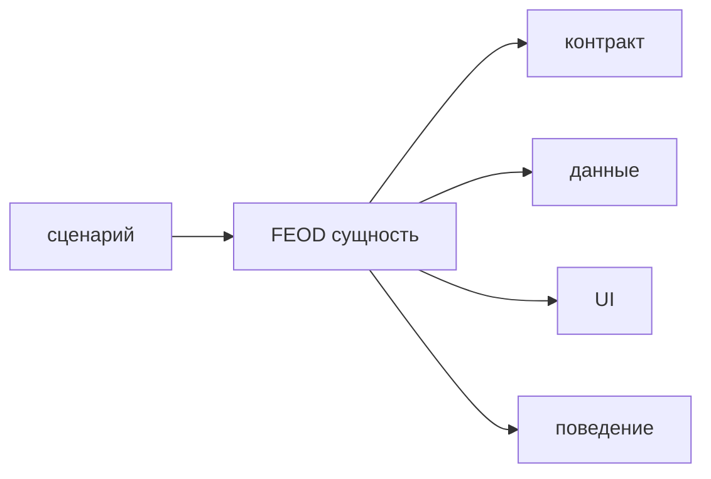

# Сущность-ориентированность



## Короткое определение

Сущность-ориентированность в FEOD означает, что каждый файл и каждая директория рассматриваются как FEOD-сущность с понятной ролью. FEOD-сущность не равна `entity` из DDD: это структурная единица, от роли которой зависят ожидания и ограничения.

## Какую проблему решает

Без этого принципа структура проекта быстро становится набором нейтральных папок и файлов, где смысл приходится угадывать по содержимому. В таком проекте сложнее проводить ревью, писать автоматические проверки и договариваться о правилах.

## Правило

Каждая FEOD-сущность должна иметь понятную роль в структуре проекта. Роль должна подсказывать, что в этой сущности ожидается увидеть, что в ней разрешено хранить и как она соотносится с соседними сущностями.

Не объясняйте FEOD-сущность через DDD. Если в тексте появляется доменная `entity`, различие нужно проговорить явно.

## Почему

Роль превращает структуру из набора имён в набор проверяемых ожиданий. Если автор видит `index.ts`, он ожидает `public API`. Если автор видит `README.md`, он ожидает описание назначения и границ. Если автор видит `ui/`, он ожидает пользовательский интерфейс, а не transport-логику.

Такие ожидания полезны для ревью. Нарушение роли видно раньше, чем ошибка уйдёт в кодовую базу.

Такие ожидания полезны и для автоматических проверок. Линтер, генератор или AI rule проще строить вокруг ролей сущностей, чем вокруг неформального ощущения "тут как-то не так".

## Good example

```text
modules/
  profile/
    README.md
    index.ts
    ui/
      ProfileCard.tsx
    model/
      useProfile.ts
      profile.types.ts
    api/
      profile-client.ts
```

Что здесь правильно:

- `profile/` является модулем и задаёт область ответственности;
- `index.ts` играет роль `public API`;
- `README.md` играет роль описания границ и назначения;
- `ui/`, `model/` и `api/` различаются не только именем, но и ожидаемым содержимым.

## Bad example

```text
modules/
  profile/
    stuff/
      index.ts
      helper.ts
      widget.tsx
      request.ts
```

Нарушение: роль сущности `stuff/` не определена, поэтому по структуре нельзя понять ни назначение, ни ограничения.

```text
modules/
  user/
    entity/
      User.ts
```

Нарушение: термин `entity` используется так, будто FEOD-сущность тождественна DDD entity, хотя это разные понятия.

## Частые ошибки

- Давать директории нейтральные имена вроде `stuff`, `misc` или `shared` внутри модуля -> роль сущности становится неясной.
- Класть в `ui/` файлы, которые управляют transport-логикой или хранением данных -> роль папки перестаёт совпадать с ожиданием.
- Описывать FEOD-сущность как доменную `entity` -> читатель переносит на структуру чужую модель и путает термины.
- Рассматривать файл только как технический контейнер -> без роли сложнее договориться о допустимом содержимом.
- Игнорировать роли при ревью -> нарушения структуры замечаются слишком поздно.

## Исключения

Исключений для самого принципа нет. Если роль сущности нельзя назвать коротко и явно, структуру нужно пересобрать.

Допустимы проектные роли сверх базовых папок, если их смысл стабилен и команда может сформулировать ожидания и ограничения так же явно, как для `index.ts`, `ui/` или `README.md`.

## Связанные страницы

- [Модульность](./modularity.md)
- [Термины](../reference/terms.md)
- [Глоссарий](../reference/glossary.md)
