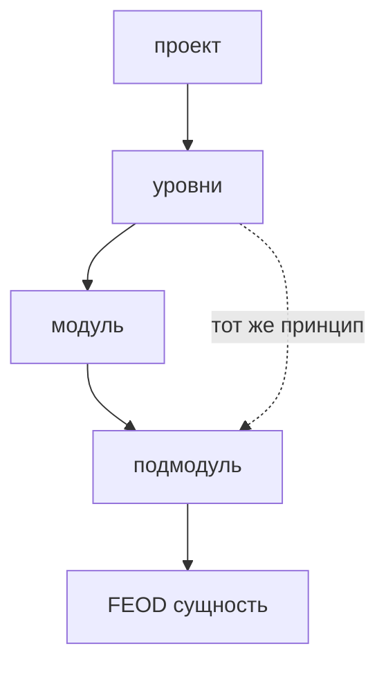

# Фрактальность



## Короткое определение

Фрактальность в FEOD означает, что модуль можно развивать внутренне по тем же принципам, по которым устроен проект целиком. Если внутри модуля появляется отдельная область ответственности, её можно оформить как подмодуль со своей структурой и своим локальным контрактом.

## Какую проблему решает

Без фрактальности большой модуль либо распухает в плоскую папку, либо дробится слишком рано на отдельные верхнеуровневые модули. В обоих случаях структура перестаёт отражать реальные границы ответственности и усложняет навигацию.

## Правило

Выращивайте структуру модуля постепенно. Если внутри модуля появляется устойчивая подзадача, оформляйте её как подмодуль с собственной зоной ответственности.

Подмодуль не становится автоматически частью `public API` всего проекта. Глубина вложенности больше двух-трёх уровней допустима только как исключение и требует явного обоснования.

## Почему

Фрактальность сохраняет один и тот же способ мышления на разных масштабах. Автору не нужно изобретать новую систему организации только потому, что модуль вырос.

Постепенное выращивание структуры снижает преждевременную сложность. Сначала достаточно плоской структуры, а подмодули появляются только там, где это подтверждено реальной ответственностью.

Ограничение глубины защищает проект от бюрократической вложенности. Чем глубже дерево, тем труднее понять, где находится граница модуля и что из него действительно разрешено использовать.

## Good example

Модуль `checkout` вырос и внутри него выделилась самостоятельная область `delivery`.

```text
modules/
  checkout/
    index.ts
    ui/
      CheckoutPage.tsx
    delivery/
      index.ts
      ui/
        DeliveryForm.tsx
      model/
        useDeliveryOptions.ts
      lib/
        map-delivery-slots.ts
    payment/
      index.ts
      ui/
        PaymentForm.tsx
      model/
        usePaymentMethods.ts
```

```ts
// modules/checkout/index.ts
export { CheckoutPage } from "./ui/CheckoutPage";
export { DeliveryForm } from "./delivery";
export { PaymentForm } from "./payment";
```

Что здесь правильно:

- подмодули `delivery` и `payment` появились как отдельные области внутри одного модуля;
- каждый подмодуль остаётся самостоятельной внутренней FEOD-сущностью;
- наружу открыто только то, что родительский модуль явно экспортировал через свой `index.ts`.

## Bad example

```text
modules/
  checkout/
    features/
      forms/
        delivery/
          parts/
            fields/
              base/
                index.ts
```

Нарушение: глубина структуры выросла из-за механической группировки, а не из-за отдельных областей ответственности.

```ts
import { DeliveryForm } from "@/modules/checkout/delivery";
import { useDeliveryOptions } from "@/modules/checkout/delivery/model/useDeliveryOptions";
```

Нарушение: подмодуль и его внутренние файлы используются как внешний контракт без явного экспорта из родительского `public API`.

## Частые ошибки

- Выделять подмодуль сразу при первых двух файлах -> структура усложняется раньше, чем появляется отдельная ответственность.
- Оставлять большой модуль плоским, когда внутри уже есть устойчивые области -> навигация и ревью становятся тяжелее.
- Считать любой `index.ts` внутри подмодуля публичным контрактом всего проекта -> это только локальная точка входа, пока родитель не открыл её наружу.
- Строить дерево глубже трёх уровней ради аккуратных папок -> глубина начинает скрывать смысл вместо того, чтобы его показывать.
- Выносить подмодуль в отдельный верхний модуль слишком рано -> проект получает лишние внешние зависимости до появления реальной самостоятельности.

## Исключения

Глубина больше двух-трёх уровней допустима, если без неё нельзя выразить устойчивые внутренние границы, а структура остаётся читаемой для команды. Такое решение должно быть редким и не должно превращать технические группировки в псевдоподмодули.

Подмодуль может получить отдельный внешний контракт, если проект явно документирует его как самостоятельную точку использования. Пока этого решения нет, внешний код работает только через `index.ts` родительского модуля.

## Связанные страницы

- [Модульность](./modularity.md)
- [Public API](../reference/public-api.md)
- [Термины](../reference/terms.md)
- [Как работать с подмодулями](../guides/submodules.md)
