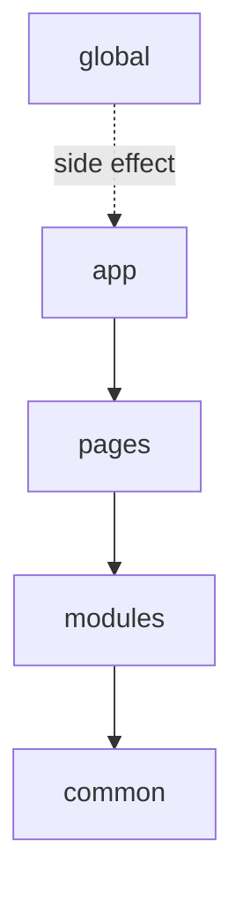

# Уровни



## Короткое определение

Уровни FEOD задают верхнюю структуру приложения и допустимые зависимости между её частями. Каждый уровень имеет свою роль, свой набор разрешённых импортов и свои запреты.

## Какую проблему решает

Без явных уровней проект быстро теряет границы. Страницы начинают тянуть детали модулей напрямую, `common` превращается в свалку, а глобальная инфраструктура смешивается с прикладным кодом.

## Правило

В FEOD используются только уровни `app`, `pages`, `modules`, `common`, `global`. Код на каждом уровне должен хранить только свою ответственность и зависеть только от тех уровней, которые разрешены матрицей импортов.

## Почему

Уровни делают структуру предсказуемой. По пути файла можно быстро понять его роль, допустимые зависимости и место в review.

## Быстрый reference

| Уровень | Назначение | Кто может импортировать | Что сам уровень может импортировать |
| --- | --- | --- | --- |
| `app` | композиция и запуск приложения | никто | `pages`, `modules`, `common` |
| `pages` | пользовательские экраны и маршруты | `app` | `modules`, `common` |
| `modules` | продуктовые сценарии и изолированные возможности | `app`, `pages`, другие `modules` | `common`, public API других модулей, public API собственных подмодулей |
| `common` | переиспользуемые технические и UI-сущности без продуктовой привязки | `app`, `pages`, `modules`, другие сущности `common` | public API других сущностей `common`, внешние пакеты |
| `global` | глобальные эффекты и инфраструктурные подключения | никто напрямую | ничего из уровней FEOD |

## Уровень `app`

### Назначение

`app` собирает приложение в целое. Здесь находятся entrypoint, корневая композиция, bootstrap, роутинг верхнего уровня, провайдеры приложения и wiring между крупными частями системы.

### Кто может импортировать

`app` не импортируется из других уровней.

### Что может импортировать

`app` может импортировать `pages`, `modules`, `common`.

`app` не импортирует `global` как прикладную зависимость и не обращается к внутренностям чужих страниц и модулей.

### Что нельзя хранить

В `app` нельзя хранить:

- логику конкретной страницы;
- внутреннюю логику отдельного модуля;
- доменно-специфичные helpers, которые должны жить в модуле;
- произвольные переиспользуемые утилиты, если они не относятся к композиции приложения.

### Good example

```ts
import { AppRouter } from "@/pages";
import { ErrorBoundary } from "@/common/error-boundary";
import { AuthSessionProvider } from "@/modules/auth";

export function App() {
  return (
    <ErrorBoundary>
      <AuthSessionProvider>
        <AppRouter />
      </AuthSessionProvider>
    </ErrorBoundary>
  );
}
```

### Bad example

```ts
import { getUserDisplayName } from "@/modules/user/lib/getUserDisplayName";

export const appTitle = getUserDisplayName();
```

Нарушение: `app` делает deep import во внутренности модуля и превращает модульную логику в часть композиции приложения.

### Типовые ошибки

- Класть в `app` продуктовую бизнес-логику вместо модуля -> `app` становится вторым `modules`.
- Импортировать внутренние файлы страницы или модуля -> ломается контракт public API.
- Хранить здесь общие helpers "на всякий случай" -> размывается граница между `app` и `common`.

## Уровень `pages`

### Назначение

`pages` хранит экраны, route-level композицию и сценарии, которые существуют в контексте конкретного маршрута или представления.

### Кто может импортировать

Уровень `pages` может импортироваться только из `app`.

### Что может импортировать

Код на уровне `pages` может импортировать `modules`, `common`.

`pages` не импортирует `app`, `global`, другие страницы и внутренности чужих модулей.

### Что нельзя хранить

В `pages` нельзя хранить:

- общий продуктовый сценарий, используемый на нескольких страницах;
- глобальную инициализацию приложения;
- код, который должен быть самостоятельным модулем;
- shared-технические сущности без привязки к странице.

### Good example

```ts
import { ProductList } from "@/modules/catalog";
import { PageLayout } from "@/common/page-layout";

export function CatalogPage() {
  return (
    <PageLayout title="Каталог">
      <ProductList />
    </PageLayout>
  );
}
```

### Bad example

```ts
import { CheckoutPage } from "@/pages/checkout";
import { ProductList } from "@/modules/catalog/ui/ProductList";
```

Нарушение: страница зависит от другой страницы и обходит public API модуля.

### Типовые ошибки

- Дублировать один и тот же пользовательский сценарий на нескольких страницах вместо выделения модуля -> логика начинает расходиться.
- Импортировать страницу в страницу -> маршруты становятся связанными напрямую.
- Складывать в `pages` reusable UI без привязки к экрану -> фактически это код уровня `common` или `modules`.

## Уровень `modules`

### Назначение

`modules` хранит продуктовые возможности, пользовательские сценарии и изолированные части предметной области. Это основной уровень для прикладной логики FEOD.

### Кто может импортировать

Уровень `modules` может импортироваться из `app`, `pages` и других `modules`.

### Что может импортировать

Код на уровне `modules` может импортировать `common`, public API других модулей и public API собственных подмодулей.

`modules` не импортирует `app`, `pages`, `global` и внутренности чужих модулей.

### Что нельзя хранить

В `modules` нельзя хранить:

- глобальные side effects и bootstrap;
- route-level композицию страницы;
- технические shared-сущности без продуктового смысла;
- публичные контракты чужих модулей, скопированные локально вместо импорта через их API.

### Good example

```ts
import { Button } from "@/common/button";
import { getUserDisplayName } from "@/modules/user";

export function InviteAuthorButton() {
  return <Button>{getUserDisplayName()}</Button>;
}
```

### Bad example

```ts
import { AppShell } from "@/app/AppShell";
import { CheckoutPage } from "@/pages/checkout";
import { normalizeUser } from "@/modules/user/lib/normalizeUser";
```

Нарушение: модуль зависит от `app`, `pages` и внутренних файлов чужого модуля.

### Типовые ошибки

- Выносить в `modules` технические utilities без продуктового контекста -> уровень `modules` теряет продуктовую ответственность.
- Импортировать чужой модуль по пути `ui`, `lib`, `model` -> модульный контракт перестаёт быть явным.
- Делать страницу тонкой обёрткой над несколькими связанными файлами в `pages` вместо отдельного модуля -> сценарий теряет переиспользуемость.

## Уровень `common`

### Назначение

`common` хранит самостоятельные переиспользуемые FEOD-сущности без привязки к конкретной продуктовой возможности. Обычно это базовый UI, утилиты, инфраструктурные адаптеры, форматтеры и другие общие контракты.

### Кто может импортировать

Уровень `common` может импортироваться из `app`, `pages`, `modules` и других сущностей `common`.

### Что может импортировать

Код на уровне `common` может импортировать public API других сущностей `common` и внешние пакеты.

`common` не импортирует `app`, `pages`, `modules`, `global` и внутренности чужих сущностей `common`.

### Что нельзя хранить

В `common` нельзя хранить:

- продуктовые сценарии и предметную логику;
- зависимости от конкретных модулей или страниц;
- глобальные эффекты уровня `global`;
- внутренности соседней сущности `common`, на которые кто-то завязался deep import-ом.

### Good example

```ts
import { clsx } from "clsx";
import { colorToCssVar } from "@/common/color";

export function badgeClassName(color: string) {
  return clsx("badge", colorToCssVar(color));
}
```

### Bad example

```ts
import { getCartSummary } from "@/modules/cart";
import { colorToCssVar } from "@/common/color/lib/colorToCssVar";
```

Нарушение: `common` зависит от продуктового модуля и делает deep import во внутренности другой сущности `common`.

### Типовые ошибки

- Складывать в `common` всё, что используется больше одного раза -> уровень превращается в свалку.
- Прятать в `common` доменные зависимости от модулей -> архитектурное направление ломается снизу вверх.
- Экспортировать из `common` внутренние файлы через случайные пути -> теряется граница самостоятельных сущностей.

## Уровень `global`

### Назначение

`global` хранит код, который действует на всё приложение целиком: shims, polyfills, глобальные декларации окружения, runtime-инициализацию и редкие side-effect подключения.

### Кто может импортировать

`global` не импортируется напрямую из `app`, `pages`, `modules`, `common`.

### Что может импортировать

`global` не импортирует ничего из уровней FEOD.

Подключение `global` выполняется через entrypoint, конфигурацию сборщика, HTML-шаблон или другой инфраструктурный механизм проекта.

### Что нельзя хранить

В `global` нельзя хранить:

- обычные прикладные helpers;
- публичный API для модулей и страниц;
- код, который зависит от `app`, `pages`, `modules` или `common`;
- продуктовые сценарии, UI и бизнес-логику.

### Good example

```ts
import "focus-visible";
import "./styles.css";
```

### Bad example

```ts
import { getOrder } from "@/modules/order";

export const env = {
  order: getOrder,
};
```

Нарушение: `global` зависит от продуктового уровня и пытается стать прикладным контрактом.

### Типовые ошибки

- Складывать в `global` всё, что "нужно везде" -> это почти всегда признак неверного уровня.
- Экспортировать из `global` переменные и helpers для прикладного кода -> `global` превращается в скрытый `common`.
- Подключать `global` напрямую из модулей и страниц -> глобальный side effect входит в продуктовый граф зависимостей.

## Исключения

Исключения допустимы только там, где их уже допускает матрица импортов: entrypoint может подключать глобальные стили или polyfills до запуска приложения, а build-time и test-time инфраструктура может использовать отдельные служебные подключения вне runtime-графа.

## Связанные страницы

- [Правила зависимостей](./dependency-rules.md)
- [Матрица импортов](../reference/import-matrix.md)
- [Public API](../reference/public-api.md)
- [Термины](../reference/terms.md)
