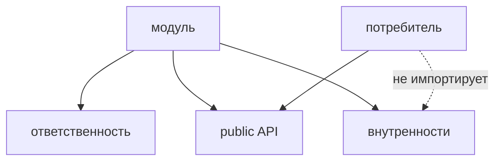

# Модульность



## Короткое определение

Модульность в FEOD означает, что модуль является самостоятельной единицей с понятной зоной ответственности. У модуля есть собственная внутренняя структура, локальная логика и явный `public API` через `index.ts`.

## Какую проблему решает

Без модульности проект быстро превращается в набор файлов без чётких границ. В таком проекте сложно понять, где заканчивается одна ответственность и начинается другая, а любое переиспользование начинает протекать через случайные deep import.

## Правило

Создавайте модуль, когда в проекте появляется самостоятельная область ответственности, которую нужно развивать, тестировать и использовать как единое целое. Внешний код должен работать с модулем только через его `public API`, а внутренние файлы модуля должны оставаться приватными.

Модуль не создают ради одного случайного файла, временной группировки или технического удобства навигации.

Компонент является отдельной UI-сущностью, страница отвечает за пользовательский маршрут или экран, а `common` хранит по-настоящему общие сущности без привязки к одной предметной области. Модуль занимает другое место: он собирает вокруг одной ответственности всё, что нужно для её работы.

## Почему

Модуль локализует изменения. Если UI, модель, интеграции и тесты одной ответственности лежат рядом, их проще менять и ревьюить вместе.

Явный `public API` через `index.ts` отделяет контракт от реализации. Это позволяет свободно перестраивать внутренности модуля, пока снаружи сохраняется тот же публичный вход.

README модуля и локальные тесты закрепляют назначение модуля на уровне артефактов, а не устных договорённостей. За счёт этого модуль остаётся понятной FEOD-сущностью даже после роста проекта.

## Good example

Модуль `notifications` решает одну задачу: показывает, хранит и обновляет пользовательские уведомления.

```text
modules/
  notifications/
    README.md
    index.ts
    ui/
      NotificationsBell.tsx
      NotificationsPanel.tsx
    model/
      useNotifications.ts
      notifications-store.ts
      notifications.types.ts
    api/
      notifications-client.ts
    lib/
      group-notifications.ts
    __tests__/
      notifications-store.test.ts
```

```ts
// modules/notifications/index.ts
export { NotificationsBell } from "./ui/NotificationsBell";
export { NotificationsPanel } from "./ui/NotificationsPanel";
export { useNotifications } from "./model/useNotifications";

export type { NotificationItem } from "./model/notifications.types";
```

Что здесь правильно:

- модуль отвечает за одну область;
- `index.ts` задаёт `public API`;
- `lib`, `api` и `model` остаются внутренностями;
- README фиксирует назначение и границы;
- тесты лежат рядом с областью ответственности.

## Bad example

```text
modules/
  common-ui/
    Button.tsx
    Modal.tsx
    useDebounce.ts
    auth-api.ts
    user-store.ts
    order-mapper.ts
```

Нарушение: каталог назван модулем, но не описывает одну самостоятельную ответственность и смешивает несвязанные сущности.

```ts
import { userStore } from "@/modules/profile/user-store";
import { authApi } from "@/modules/profile/auth-api";
```

Нарушение: внешний код идёт во внутренние файлы модуля вместо `public API`.

## Частые ошибки

- Создавать модуль для одного компонента без собственной ответственности -> это обычно компонент, а не модуль.
- Превращать страницу в модуль только потому, что экран большой -> страница и модуль решают разные задачи.
- Называть модулем папку с разнородными утилитами -> такая папка не даёт границы ответственности.
- Складывать предметный код в `common`, потому что он нужен в двух местах -> общий импорт сам по себе не отменяет принадлежность к конкретной ответственности.
- Экспортировать из `index.ts` почти всё подряд -> `public API` начинает отражать файловую структуру, а не контракт.
- Хранить общие внутренние файлы модуля в `common` -> модуль теряет локальность и начинает протекать наружу.
- Оставлять модуль без README, когда его назначение не очевидно -> следующему автору сложнее понять границы и правила использования.
- Проверять модуль только через страницы и не иметь локальных тестов для его поведения -> ошибки труднее локализовать внутри самой ответственности.

## Исключения

Маленький модуль без `README.md` допустим, если его назначение очевидно из имени, структуры и `public API`, а команда не теряет из-за этого контекст. Это исключение не отменяет правило о явной ответственности и не делает deep import допустимым.

Временный модуль для миграции допустим, если у него уже есть чёткая граница и план упрощения. Временность не оправдывает смешение нескольких независимых областей в одном модуле.

## Связанные страницы

- [Public API](../reference/public-api.md)
- [Термины](../reference/terms.md)
- [Code smells](../reference/code-smells.md)
