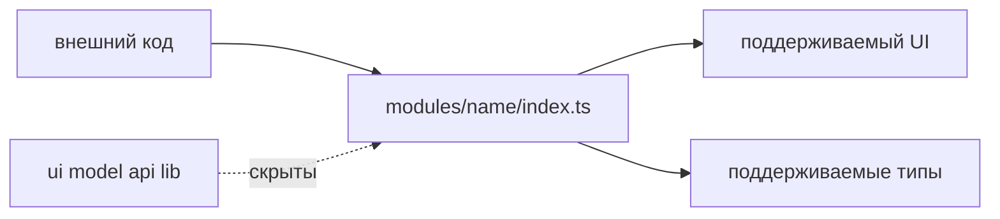

# Публичный API



## Короткое определение

Публичный API FEOD-сущности - это явный поддерживаемый вход, через который внешний код может использовать эту сущность. Для модуля таким входом обычно является корневой `index.ts`.

## Какую проблему решает

Без public API потребители начинают импортировать внутренние файлы. После этого перемещение компонента, переименование hook или разделение модели становятся ломящими изменениями для всего проекта.

## Правило

Внешний код должен использовать модуль через его public API. Внутренние файлы модуля не являются контрактом для внешних потребителей.

## Почему

Public API отделяет намерение от реализации. Команда видит, что модуль обещает поддерживать, и может менять внутреннюю структуру без переписывания всех потребителей.

## Good example

```ts
// src/modules/user/index.ts
export { UserCard } from './ui/user-card';
export { useUser } from './model/use-user';
export type { User } from './model/types';
```

```ts
// src/pages/profile/ui/profile-page.tsx
import { UserCard, useUser } from '@/modules/user';
```

Потребитель зависит от контракта модуля, а не от его внутренней структуры.

## Bad example

```ts
// src/pages/profile/ui/profile-page.tsx
import { UserCard } from '@/modules/user/ui/user-card';
import { useUser } from '@/modules/user/model/use-user';
```

Нарушение: страница обходит public API и закрепляет внутренние пути модуля как внешний контракт.

## Частые ошибки

- Экспортировать всё через `export *` -> наружу попадают случайные внутренние детали.
- Держать public API только в README -> импорты в коде всё равно обходят контракт.
- Считать любой `index.ts` публичным для всего проекта -> `index.ts` подмодуля может быть локальным входом внутри родителя.
- Экспортировать debug-компоненты вместе с пользовательскими компонентами -> временная реализация становится поддерживаемым API.

## Исключения

Исключения допустимы только внутри самой FEOD-сущности. Внутренние файлы модуля могут импортировать друг друга напрямую, если это не выходит за границу модуля.

## Связанные страницы

- [Public API](../reference/public-api.md)
- [Контракт модуля](../reference/module-contract.md)
- [Матрица импортов](../reference/import-matrix.md)
- [Code smells](../reference/code-smells.md)
