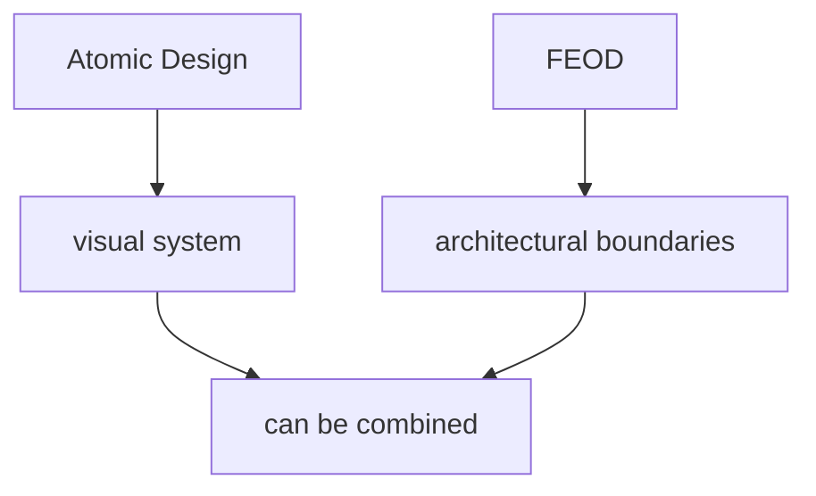

# Comparison with Atomic Design

Atomic Design and FEOD answer different questions. Atomic Design helps classify UI components by composition level. FEOD helps organize frontend code by responsibility, levels, `public API`, and controlled dependencies.



These approaches can be combined, but one cannot replace the other. Atomic Design does not answer who may import a module, where route-level composition lives, or why a deep import violates a contract. FEOD does not try to classify every UI component as an atom, molecule, or organism.

## Short comparison

| Question | Atomic Design | FEOD |
| --- | --- | --- |
| Main object | UI component | FEOD entity: level, module, page, common item |
| Main criterion | Degree of UI composition | Responsibility and dependency direction |
| Typical structure | Atoms, molecules, organisms, templates, pages | `app`, `pages`, `modules`, `common`, `global` |
| What it protects | Consistency of a UI system | Architectural boundaries and public contracts |
| Where it is especially useful | Design system and component library | Application with product logic and modules |

## How the approaches combine

Atomic Design can live inside a UI library or `common/ui` if the team uses that classification for a design system. FEOD remains the source of architectural boundaries: where code is located, who may import it, and through which contract it is available.

Example of an acceptable combination:

```text
src/
  common/
    ui/
      atoms/
      molecules/
      organisms/
      index.ts
  modules/
    checkout/
      components/
      model/
      index.ts
```

In this example, Atomic Design helps organize shared UI primitives, while FEOD separates the shared UI library from the product module `checkout`.

## Where the boundary is

If a component contains product responsibility, user-flow state, or knowledge of a specific domain, it does not become `common/ui` just because it visually resembles an organism. Its place is determined by FEOD responsibility.

For example, `CheckoutSummary` with cart and payment rules should live in the `checkout` module or a related product module. A shared `Card`, `Button`, or `Modal` can live in `common/ui` if it knows nothing about a specific domain.

## Typical mistake

Violation:

```text
src/
  atoms/
  molecules/
  organisms/
  templates/
  pages/
```

This structure makes Atomic Design the top-level architecture of the application and loses FEOD levels. From it, you cannot tell where `app` is, where product modules are, where shared technical code lives, or which dependencies are allowed.

## When Atomic Design is enough

Atomic Design can be enough for a design system or a small component library. An application with routes, product flows, API clients, state, and multiple teams usually needs additional architectural boundaries.

FEOD covers exactly that area: application structure and the rules for interaction between its parts.

## Related pages

- [Common](../structure/common.md)
- [Modules](../structure/modules.md)
- [Where to place code](../guides/where-to-place-code.md)
- [Code smells](../reference/code-smells.md)
