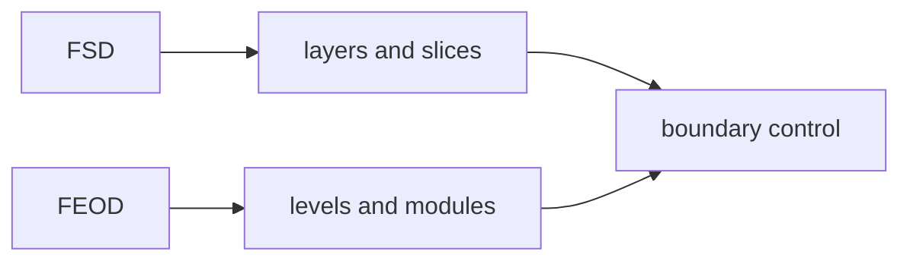

# Comparison with FSD

FEOD and FSD solve a similar problem: making the structure of a frontend project understandable, durable, and suitable for team development. The difference is in how they describe boundaries and which building block they put at the center.



FEOD uses the `app`, `pages`, `modules`, `common`, `global` levels and centers the module with an explicit `public API`. FSD uses its own taxonomy of layers, slices, and segments. For that reason, FEOD is not a renamed FSD and does not require moving FSD layers into a project.

## Short comparison

| Question | FSD | FEOD |
| --- | --- | --- |
| Primary structural language | Layers, slices, segments | Levels, modules, FEOD entities |
| Main building block | Slice within a layer | Module with responsibility and `public API` |
| Top-level structure | Usually `app`, `pages`, `widgets`, `features`, `entities`, `shared` | `app`, `pages`, `modules`, `common`, `global` |
| Reuse boundary | Depends on the layer and the slice public API | Depends on the level and the FEOD entity's `public API` |
| Focus | Detailed classification of frontend code by domain-model layers and UI composition | Direct control of modules, dependencies, and contracts |

## What FEOD simplifies

FEOD reduces the number of top-level categories. Instead of splitting product code across several FSD layers, the methodology gathers product responsibilities in `modules`.

This is useful for teams that need strict dependency control but do not need constant classification between `entities`, `features`, and `widgets`. Controversial code is more often resolved by asking "what is its responsibility and what is its `public API`" than by choosing between several neighboring layers.

## What FEOD does not copy

FEOD does not import FSD layers as a required internal structure. In FEOD, the primary term is "level"; "layer" is acceptable only as an explanation for an audience familiar with FSD.

Violation:

```text
src/
  modules/
    entities/
    features/
    widgets/
```

This transfer preserves FSD as an internal taxonomy and turns FEOD into an external rename. If a project migrates from FSD, the responsibilities of modules must be rebuilt rather than mechanically nesting old layers inside `modules`.

## Where the approaches are similar

Both approaches value explicit boundaries, dependency limits, and public entry points. In both cases, deep imports hurt maintainability: external code starts depending on internal structure instead of a supported contract.

Similarity of goals does not mean identical rules. When using FEOD, the normative sources remain [Levels](../core-concepts/levels.md), [Import matrix](../reference/import-matrix.md), and [Public API](../reference/public-api.md).

## When the comparison is useful

A comparison with FSD is useful if the team has already used FSD and wants to understand how to move to FEOD without losing discipline. In that case, start with [Migration from FSD](../guides/migration-from-fsd.md): it maps old categories to FEOD responsibilities and shows where the `public API` needs to be rebuilt.

If the team has not used FSD, the comparison can be skipped. For a first introduction, [Overview](../get-started/overview.md) and [Quick start](../get-started/quick-start.md) are enough.

## Related pages

- [Migration from FSD](../guides/migration-from-fsd.md)
- [Terms](../reference/terms.md)
- [Levels](../core-concepts/levels.md)
- [Import matrix](../reference/import-matrix.md)
