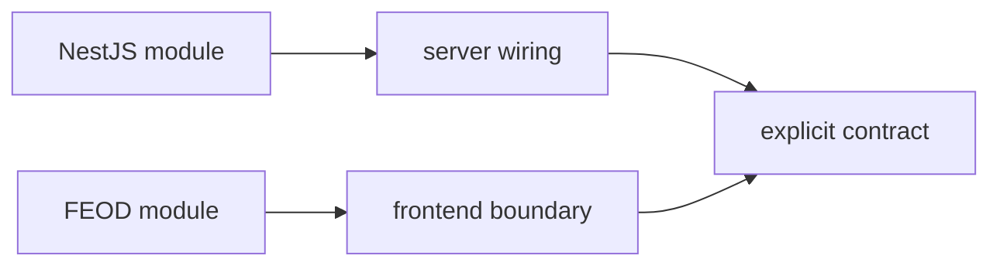

# Comparison with NestJS Modules

A FEOD module and a NestJS module are similar only at the broad idea of a boundary. Both approaches help group related responsibility and show what is available outside. But a NestJS module is a runtime construct of a backend framework, while a FEOD module is a structural unit of a frontend codebase.



The comparison is useful for teams used to thinking about modules through `imports`, `providers`, `controllers`, and `exports`. In FEOD, these categories do not become the norm. The methodology describes frontend application source code, not a dependency container.

## Short comparison

| Question | NestJS module | FEOD module |
| --- | --- | --- |
| Where it applies | A NestJS backend application | A frontend application regardless of UI framework |
| What the module is | A class with metadata for DI and runtime composition | A directory or FEOD entity with responsibility and `public API` |
| How the external contract is defined | `exports` in module metadata | Root `index.ts` or another explicit `public API` |
| How parts are connected | Through DI, providers, and module imports | Through TypeScript/JavaScript imports under FEOD rules |
| What the approach checks | The NestJS runtime dependency graph | Source structure and architectural dependencies |

## Main difference

A NestJS module participates in building the application's runtime graph. It registers providers, controllers, imports, and exports, and the framework uses that information for dependency injection.

A FEOD module does not require a DI container. Its boundary is expressed through file structure, import rules, and an explicit `public API`. External code should not know how the module is organized inside if the required contract is exported outward.

## What to take from the comparison

The useful lesson from NestJS modules is contract discipline: if a piece of code is not exported, a consumer should not use it directly. In FEOD, this idea is expressed through `public API` and the ban on deep imports.

At the same time, FEOD does not require every module to be shaped like a service container. A frontend module can contain components, hooks, stores, API clients, types, and helper FEOD entities. The exact set depends on the module's task and the chosen frontend stack.

## Typical mistake

Violation:

```text
src/
  modules/
    user/
      providers/
      controllers/
      module.ts
      index.ts
```

This structure transfers a backend model into the frontend without checking the role of the files. If a frontend module needs a provider or service, that should follow from the module's local task, not from an attempt to copy NestJS terms.

## Where wiring lives

In FEOD, top-level application wiring belongs to `app`: router, providers, bootstrap, layout shell, and application-level integrations. A module may have internal composition, but it should not turn into a global dependency container for the whole project.

If a module needs external dependencies, first define its `public API` and responsibility boundary. Then decide where the dependency is connected: inside the module, on a page, or in `app`.

## Related pages

- [Modules](../structure/modules.md)
- [App](../structure/app.md)
- [Public API](../reference/public-api.md)
- [Dependency rules](../core-concepts/dependency-rules.md)
