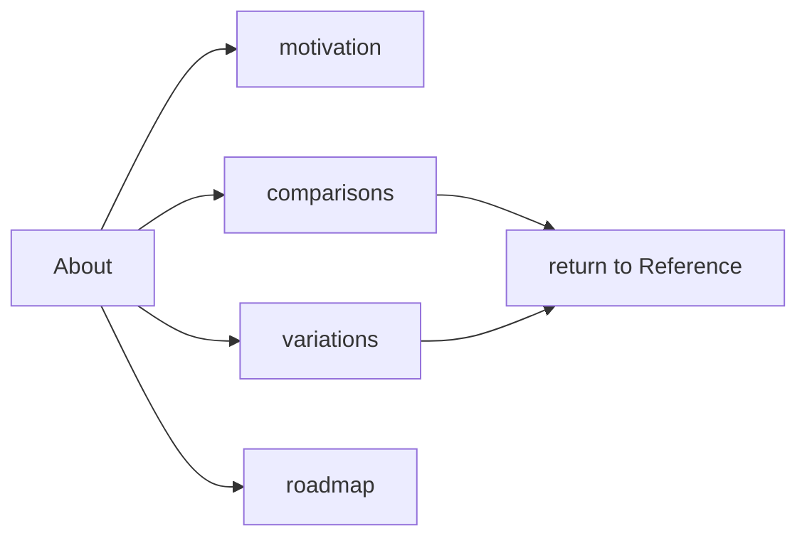

# About

About explains why FEOD exists, what to compare it with, and where the methodology is heading. This section helps evaluate the approach, but it does not replace the first learning path and is not a source of normative rules.

If you need a quick start, follow [Overview](../get-started/overview.md), [Quick start](../get-started/quick-start.md), [Levels](../core-concepts/levels.md), [Import matrix](../reference/import-matrix.md), and [Public API](../reference/public-api.md).

## What to read in About

- [Motivation](./motivation.md) - why FEOD distinguishes levels, modules, `public API`, and controlled dependencies.
- [Comparison with FSD](./comparison-fsd.md) - how FEOD differs from FSD and when the comparison is useful.
- [Comparison with NestJS modules](./comparison-nestjs-modules.md) - why a FEOD module is not a runtime DI module.
- [Comparison with Atomic Design](./comparison-atomic-design.md) - how FEOD relates to the UI taxonomy of components.
- [FEOD Variations](./variations.md) - which controlled variations may exist and why they do not replace the canonical structure.
- [Roadmap](./roadmap.md) - which documentation and tooling directions exist without a promise of dates.

## Role of this section

About answers evaluation questions:

- why FEOD is needed as a separate methodology;
- what problem is solved by the fixed `app`, `pages`, `modules`, `common`, `global` structure;
- how FEOD differs from similar approaches;
- which decisions are part of the current canon;
- which directions remain future development.

About does not store the import matrix, `public API` rules, glossary, level reference, or step-by-step guides. If a comparison page leads to a FEOD rule, the rule itself should live in `Reference`, `Structure`, or `Core Concepts`.

## When to read About

Read About after a basic introduction to FEOD if you need to:

- explain the methodology to a team or tech lead;
- compare FEOD with an architectural model you already know;
- understand why FEOD does not copy FSD, NestJS, or Atomic Design;
- evaluate future directions without mixing the roadmap with current rules.

A beginner does not need to start with About. The first route should go through a practical entry point; About becomes useful when you need motivation, positioning, or comparison.
