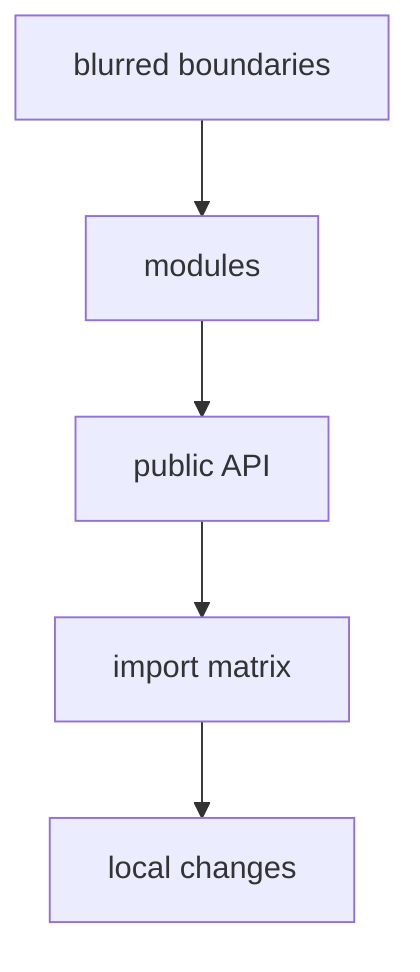

# Motivation

FEOD emerged as a response to a common frontend project problem: structure grows faster than the team can keep boundaries in verbal agreements. Folders exist, but they do not always make it clear where business responsibility lives, where shared technical code belongs, where the application assembly point is, and through which contract a neighboring module can be used.

The methodology introduces one stable frame for a frontend application: `app`, `pages`, `modules`, `common`, `global`. This frame exists not for folder naming, but for predictable dependencies and clear responsibility for each part of the project.

## What problem FEOD solves

Without explicit architectural boundaries, a project usually drifts into the same violations:

- pages start importing internal module files;
- a module becomes a set of disconnected components without a public contract;
- `common` turns into a dumping ground for everything that is hard to classify;
- global declarations and side-effect imports get mixed with application code;
- a new project member has to learn the rules from the team instead of from the structure.

FEOD makes these boundaries visible. The location of a FEOD entity should make its role clear and show who is allowed to use it.

## Why splitting into modules is not enough

Typical modular architecture often captures only the idea of "split the project into parts". It does not answer these questions strictly enough:

- whether an internal file of a neighboring module may be imported;
- what counts as the module's public contract;
- where the module ends and shared technical code begins;
- where route-level composition should live;
- how to repeat the structure inside large modules.

FEOD adds level, `public API`, and import rules to modularity. A module remains an independent unit, but its interaction with the rest of the project becomes checkable.

## Why `public API` matters

`public API` separates the supported contract from a module's internal implementation. External code uses the module through an explicit entry point, and the module can change private files without rewriting every consumer.

This reduces coupling. The team discusses the neighboring module's contract rather than its internal structure: what the module promises outward and which details remain private.

Detailed rules are in [Public API](../reference/public-api.md).

## Why FEOD is fractal

Fractality is needed so the same organizational logic works at different scales. A project is divided into levels and modules; a large module may split itself into submodules; a submodule should also have clear responsibility and a boundary.

Fractality does not mean infinite nesting. It supports gradual structural growth when a new internal area of responsibility has genuinely become independent. Detailed constraints are described in [Fractality](../core-concepts/fractality.md) and [Working with submodules](../guides/submodules.md).

## Why FEOD is not tied to a framework

FEOD describes frontend application architecture, not the API of a specific UI framework. It can be applied in projects on different frontend stacks if the project has pages, product areas, shared technical FEOD entities, and a need to control dependencies.

The framework affects files inside FEOD entities: components, hooks, composables, stores, router, and providers. But the roles of levels and the access rule through `public API` remain methodological rather than framework-specific.

## When FEOD is especially useful

FEOD is worth considering when:

- the project grows beyond a short-lived prototype;
- several developers work on the codebase;
- there are recurring user flows and product areas;
- the team faces deep imports and implicit dependencies;
- onboarding a new contributor takes too many verbal explanations;
- architectural rules need to be checked in review or future tools.

For a small throwaway prototype, FEOD may be excessive. The methodology is useful where the cost of explicit boundaries is lower than the cost of constantly untangling dependencies.

## Related pages

- [Overview](../get-started/overview.md)
- [Modularity](../core-concepts/modularity.md)
- [Levels](../core-concepts/levels.md)
- [Import matrix](../reference/import-matrix.md)
- [Public API](../reference/public-api.md)
