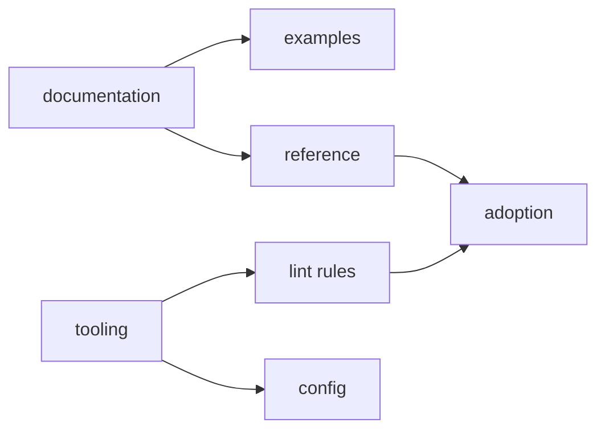

# Roadmap

Roadmap describes directions for FEOD documentation and tooling. It does not promise dates, tool readiness, or a required delivery order. If a direction has not yet been confirmed by a separate artifact, treat it as future development.

The source of current FEOD rules is `Core Concepts`, `Structure`, `Guides`, and `Reference`. Roadmap explains what may be expanded later, but it does not replace normative pages.

## Current focus

The first documentation stage captures the canonical FEOD core:

- the `app`, `pages`, `modules`, `common`, `global` levels;
- modularity, fractality, and entity orientation;
- `public API` as the supported contract of a FEOD entity;
- the import matrix and the ban on deep imports;
- practical guides for code placement, module design, and migration;
- examples of projects of different sizes.

The goal of this stage is to reduce ambiguity. The documentation should be useful without mandatory tooling and without binding FEOD to a specific frontend framework.

## Documentation directions

The following directions may expand the documentation after the basic core stabilizes:

| Direction | What it should provide |
| --- | --- |
| Tutorial path | Connected scenarios: a new project, an existing project, the first module, step-by-step migration. |
| More examples | Realistic projects with different types of modules, pages, and `common` entities. |
| Advanced guides | Materials about SSR, BFF, microfrontends, and complex integration boundaries after the basic rules. |
| Review checklist | Checkable lists for architectural reviews of FEOD projects. |
| Migration stories | Analyses of migration from FSD, regular modular architecture, and component-first structures. |

Advanced topics should not enter the first learning path. They become useful only after the reader understands levels, `public API`, and the import matrix.

## Tooling directions

Tooling remains secondary to the methodology. At the first stage, only directions captured in the PRD should be described:

| Direction | Role |
| --- | --- |
| ESLint plugin | Check architectural violations: deep imports, reverse dependencies, bypassing `public API`. |
| AI rules | Give AI assistants rules for project structure, code generation, and review. |
| FEOD config | Capture levels, modules, and allowed deviations as a machine-readable contract. |

If the technical implementation of a tool is not confirmed, the page should describe a product scenario or roadmap, not a finished product.

## What is not part of the first stage

The following topics are deliberately deferred:

- a separate English documentation version;
- separate FEOD editions for React, Vue, Nuxt, Next, or Svelte;
- several equal canonical FEOD variants;
- promises of ready-made tools without a confirmed implementation;
- positioning FEOD as a universal architecture for backend or any software system.

FEOD remains a framework-agnostic methodology for frontend applications. Extensions may appear later, but they must not blur the current canon.

## How to read the roadmap

Roadmap is for understanding direction, not for checking rules. If you need to make an architectural decision in a project, use:

- [Import matrix](../reference/import-matrix.md);
- [Public API](../reference/public-api.md);
- [Levels](../core-concepts/levels.md);
- [Where to place code](../guides/where-to-place-code.md);
- [Code smells](../reference/code-smells.md).
