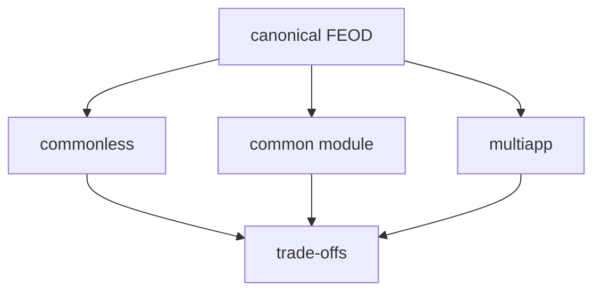

# FEOD Variations

This page describes controlled deviations from the canonical FEOD structure. They are not needed for a first introduction to the methodology. Use them only when the base structure is already understood and there is a concrete reason to change it.

The canonical FEOD structure remains the same: `app`, `pages`, `modules`, `common`, `global`. If a project chooses a variation, it should capture that decision explicitly and describe which import and `public API` rules change.



## When to Consider a Variation

A variation is acceptable only when the base rule creates a persistent operational problem. It should not be used as a way to avoid boundary discipline.

| Situation | Possible Variation | Check First |
| --- | --- | --- |
| The project is small and the `common` boundary causes repeated disputes | Commonless FEOD | Make sure code is not being extracted from modules too early |
| Shared technical code needs one module-like contract | Common Module | Make sure `common` is not becoming a product module |
| One codebase builds several applications | Multiapp | Check whether one thin `app` with separate entrypoints is enough |

If the project has not stabilized levels, `public API`, and the import matrix yet, postpone the variation.

## Commonless FEOD

Commonless FEOD removes the top-level `common` level. Entities that would live in canonical `common` are placed in `modules` as technical or infrastructure modules.

Example:

```text
src/
  app/
  pages/
  modules/
    ui/
    date/
    string/
    auth/
    checkout/
  global/
```

This option may fit a small project where a separate `common` creates more debate than value. It lowers the cost of asking "is this already common or still a module?", but it shifts the burden to module design rules.

### What It Provides

- Fewer decisions about the boundary between `common` and `modules`.
- Technical entities get the same `public API` discipline as other modules.
- Code can move between technical and product modules through one contract model.

### Risks

- The module list grows faster and becomes harder to scan.
- Technical and product modules start looking the same even though they have different responsibilities.
- Module links become denser if the team stops checking the purpose of each entity.

### Rules

Create a new entity as a submodule or as part of an existing module if it does not yet have an independent responsibility. Do not promote every helper into a separate module.

Group technical code by meaning, not by a generic container. `date`, `string`, and `ui` are better than `utilities`, `helpers`, `types`, or `constants`.

Do not recreate pseudo-`common` inside `modules`. A `utilities` module with unrelated functions repeats the same problem and explains responsibility worse.

An exception is acceptable for truly technical utility types: `Flatten<T>`, `Either<L, R>`, `Brand<T, Name>`. Domain types should remain in the module that owns that domain.

## Common Module

Common Module is a hybrid option where `common` is treated as a separate module with a `public API`, not as its own top-level level.

Example:

```text
src/
  app/
  pages/
  modules/
    common/
      index.ts
      ui/
      date/
      string/
    auth/
    checkout/
  global/
```

This option is useful when tooling, aliases, or internal project policy require the same module-like contract for all importable FEOD entities.

### What It Provides

- Shared technical code gets one `public API` entry point.
- The project root stays shorter because `common` no longer competes with `modules`.
- Imports can be centralized through one contract when the project needs that.

### Risks

- The responsibility of `modules/common` can become vague.
- The shared module's `public API` changes often because many consumers depend on it.
- The team may be tempted to let the shared module import product modules.

### Rules

Keep the same discipline as canonical `common`: the shared module must not contain business logic, scenario state, or APIs of a specific product area.

Do not let `modules/common` depend on product modules. If the shared module imports `auth`, `user`, or `checkout`, it is no longer a shared technical contract.

Split a large `public API` into named public subcontracts when one root import becomes noisy:

```ts
import { Button } from "@/modules/common/ui";
import { formatDate } from "@/modules/common/date";
```

This import is allowed only when `ui` and `date` are public subcontracts of the shared module, not deep imports into its internals.

## Multiapp

Multiapp is a variation for a monorepo or one frontend codebase that builds several applications. The top-level `app` becomes `apps`, while shared `pages`, `modules`, `common`, and `global` stay at the top level.

Example:

```text
src/
  apps/
    main-site/
      app/
      pages/
      modules/
      global/
    commercial-landing/
      app/
      pages/
    electron-app/
      app/
  pages/
  modules/
  common/
  global/
```

Local `pages`, `modules`, and `global` inside a specific application belong only to that application. When an entity becomes useful to several applications, it can move to the shared top level.

### What It Provides

- Several applications can use one shared set of modules and pages.
- Each application still has private composition, entrypoints, and integrations.
- Code can move from an application's private area to the shared area without changing methodology.

### Risks

- `apps` can become a second project root with hidden rules.
- Shared `pages` can start depending on details of a specific application.
- Private modules can remain private even after multiple applications start needing them.

### Rules

Keep `app` thin inside each application. It is responsible for startup, providers, routing, and wiring, not for business logic.

Separate private and shared entities by actual consumers. If a module is needed only by `electron-app`, it stays in `apps/electron-app/modules`. If two applications use it, it moves to top-level `modules`.

Do not let shared `modules` import code from `apps/*`. The dependency should go from the application to shared pages, modules, and `common`, not in the opposite direction.

## How to Capture a Variation

A project that chooses a FEOD variation should describe it in an architecture decision or README:

- the variation name;
- which levels change;
- which import rules remain canonical;
- which exceptions are allowed;
- how the variation affects aliases, lint rules, and FEOD config;
- when the decision should be reviewed.

Without this record, a variation becomes an implicit exception. That is worse than the canonical structure because the team loses a shared language for review.

## Related Pages

- [Levels](../core-concepts/levels.md)
- [Import matrix](../reference/import-matrix.md)
- [Public API](../reference/public-api.md)
- [How to Keep common from Becoming a Dumping Ground](../guides/common-boundaries.md)
- [FEOD config](../tools/feod-config.md)
