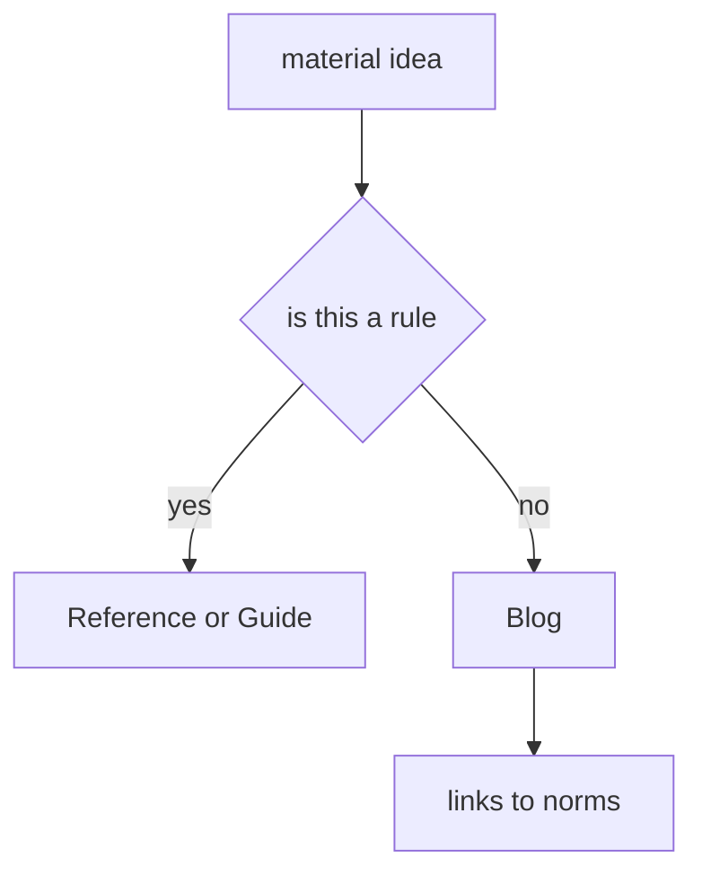

# Blog

Blog is for context, stories, and discussion of architectural decisions. It is not a normative part of the documentation and should not replace `Docs`.

## What can be published

Blog is a good place for materials that need authorial context:

- why FEOD appeared;
- real migration stories;
- comparisons of approaches;
- architectural mistakes in projects;
- trade-offs and controversial questions;
- notes about tooling development.

## What must not be moved to Blog

The following materials should live in `Docs`, not in Blog:

- the import matrix;
- public API rules;
- term definitions;
- glossary;
- level rules;
- naming rules;
- code smells as a normative list.

If an article explains a rule, it should link to the corresponding `Reference` page. The reader should not have to search for the norm in a long article.

## Editorial rule

Blog can have a more lively tone than the reference section, but it must not conflict with normative documentation. If an article proposes an exception, the exception should be described as a contextual trade-off, not as a new general norm.

## Related sections

- [Import matrix](../reference/import-matrix.md)
- [Public API](../reference/public-api.md)
- [Code smells](../reference/code-smells.md)
- [Where to place code](../guides/where-to-place-code.md)
