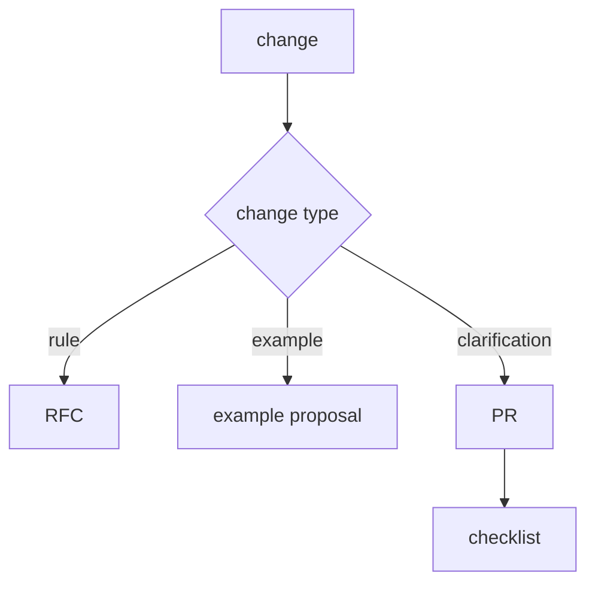

# How to Contribute

This section describes contributing to the FEOD documentation. Normative methodology rules change through explicit proposals, not through accidental text edits.

## What you can propose

- fixes for imprecise wording;
- new good/bad examples;
- new tutorial scenarios;
- framework appendices;
- glossary clarifications;
- proposals for tooling pages.

## What requires discussion

Separate discussion is required for:

- changing the import matrix;
- changing canonical levels;
- adding a new exception to public API;
- changing the interpretation of `common` or `global`;
- moving a normative rule from Reference to Blog or Community.

## How to prepare a change

1. Determine the page type: onboarding, tutorial, guide, reference, tools, or community.
2. Check related pages so you do not create a duplicate.
3. Add a good/bad example if the change concerns a rule.
4. Check links to existing `.md` pages.
5. Run docs build and docs check.

## Checklist

- The change does not conflict with the [Import matrix](../reference/import-matrix.md).
- Terms match [Terms](../reference/terms.md).
- The new material does not create a `Miscellaneous` section.
- About materials are not mixed with tutorial or reference.
- If a rule is controversial, there is a `Why` section or a link to a normative page.

## Related pages

- [RFC process](./rfc-process.md)
- [How to propose examples](./examples.md)
- [Exceptions to rules](./exceptions.md)
