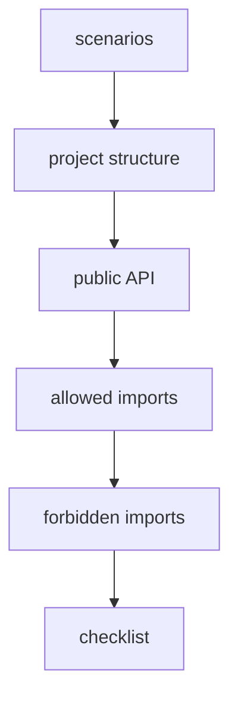

# How to Propose Examples

Examples should show FEOD applied to realistic scenarios. They do not replace reference pages and do not introduce new rules.



## Requirements for an example

A good example contains:

- the goal of the example;
- user scenarios;
- project tree;
- public API of key modules;
- allowed imports;
- forbidden imports;
- verification checklist;
- links to reference pages.

## Minimum structure

```md
# Example: <title>

## Goal of the example

## Scenarios

## Project structure

## Public API of modules

## Allowed imports

## Forbidden imports

## Example checklist
```

## Good example

The example shows why `checkout` imports `cart` through public API:

```ts
import { useCart } from '@/modules/cart';
```

Then it shows a violation:

```ts
import { cartStore } from '@/modules/cart/model/cart-store';
```

Violation: the example fixes the boundary of the rule in a concrete scenario.

## Bad example

The example contains only a large file tree without explaining the scenario.

Violation: the reader sees the structure but does not understand why the boundaries are drawn this way.

## Checklist

- The example is connected to a real user scenario.
- It has at least one public API.
- It has good/bad imports.
- It links to `Reference` if it demonstrates a rule.
- It does not create a new norm outside reference pages.

## Related pages

- [Minimal SPA](../examples/minimal-spa.md)
- [E-commerce](../examples/ecommerce.md)
- [Dashboard / Admin Panel](../examples/dashboard-admin.md)
