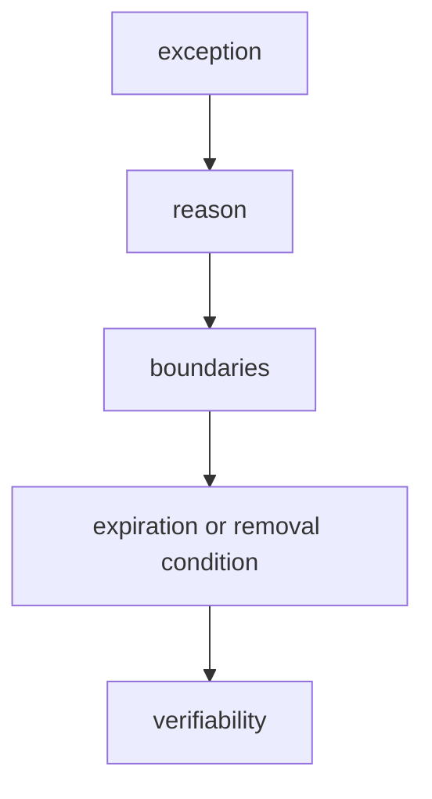

# Exceptions to Rules

An exception in FEOD is an explicit local deviation from a rule with a reason and boundaries. An exception must not become a hidden new norm.



## When to discuss an exception

Discussion is needed if a change:

- violates the import matrix;
- exposes an internal module file to external consumers;
- puts domain code in `common`;
- uses `global` as shared;
- changes the canonical project structure.

## Exception format

```md
## Exception: <short title>

- Rule: <which rule is violated>
- Scope: <files, module, or team>
- Reason: <why the rule cannot be followed now>
- Expiration or review condition: <when to revisit>
- Owner: <who is responsible for removal or extension>
```

## Good example

```md
## Exception: legacy cart imports

- Rule: no deep imports from modules
- Scope: `src/pages/legacy-cart/**`
- Reason: the page is being migrated separately from the `cart` module
- Review condition: after `modules/cart/index.ts` appears
- Owner: cart team
```

The exception is limited and connected to migration.

## Bad example

```md
Deep imports are allowed when they are faster.
```

Violation: there is no scope, reason, review deadline, or owner.

## Checklist

- The exception references a specific rule.
- The exception scope is limited.
- The reason is verifiable.
- There is a review condition.
- The exception is not hidden inside Blog or Community as a new norm.

## Related pages

- [Import matrix](../reference/import-matrix.md)
- [Code smells](../reference/code-smells.md)
- [RFC process](./rfc-process.md)
