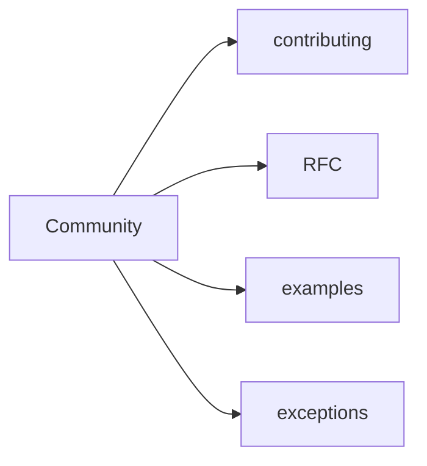

# Community

This section stores community materials: contribution, RFCs, example proposals, and discussion of exceptions to FEOD rules.

At the current stage, there are no normative rules here. If a material defines a methodology rule, it should live in `Docs` or `Reference`, not in `Community`.

## Materials

- [How to contribute](./contributing.md)
- [RFC process](./rfc-process.md)
- [How to propose examples](./examples.md)
- [Exceptions to rules](./exceptions.md)

## Related pages

- [Overview](../get-started/overview.md)
- [About](../about/index.md)
- [Tools](../tools/index.md)
