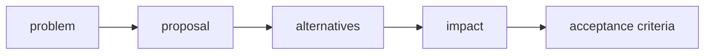

# RFC Process

An RFC is needed for changes that alter FEOD rules, documentation structure, or the behavior of future tools.



## When an RFC is needed

An RFC is needed if the proposal:

- changes the import matrix;
- adds or removes a top-level level;
- changes the definition of public API;
- introduces a new rule for `common` or `global`;
- adds a mandatory tooling requirement;
- changes the target information architecture.

## RFC format

```md
# RFC: <title>

## Problem

<which ambiguity or pain we are solving>

## Proposal

<what changes>

## Alternatives

<which options were considered>

## Documentation impact

<which pages need to change>

## Tooling impact

<what changes for lint rules, AI rules, or config>
```

## Acceptance criteria

- The proposal does not break the basic learning path without necessity.
- Reference remains the strict source of rules.
- The change has good/bad examples.
- Tooling impact is described explicitly.
- Exceptions have applicability boundaries.

## What is not an RFC

No RFC is needed for:

- fixing a typo;
- adding a link to an existing rule;
- clarifying an example without changing the norm;
- adding a new framework appendix if it does not change the basic rules.

## Related pages

- [How to contribute](./contributing.md)
- [Exceptions to rules](./exceptions.md)
- [FEOD config](../tools/feod-config.md)
