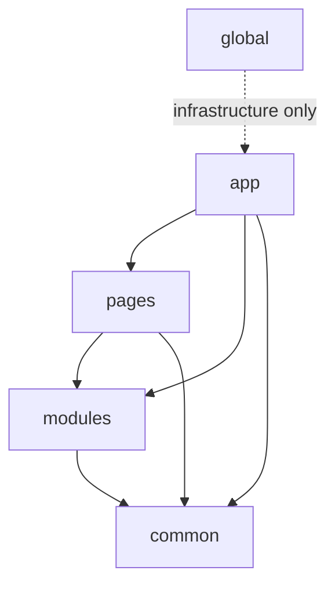

# Dependency Rules



## Short Definition

FEOD dependency rules define which direction imports may go, which contracts can connect levels, and why internal files must not be imported directly.

## What Problem It Solves

Without explicit dependency rules, the structure quickly stops being verifiable. Modules start leaking their internals outward, `common` pulls in product code, and `global` turns into a hidden API.

## Rule

In FEOD, a dependency is always read from the import: if `A` imports `B`, then `A` depends on `B`. Only dependencies listed in the import matrix are allowed, and access to another FEOD entity goes only through its public API.

## Why

This makes the architecture verifiable and localizes change. If a dependency does not pass through an explicit contract, it is impossible to reliably understand what counts as a supported interface and what is an implementation detail.

## Dependency Direction

The dependency direction matches the import direction.

```text
A -> B
```

This means:

- `A` imports `B`;
- `A` depends on `B`;
- `A` uses `B`.

Reverse wording such as "`B` is used from `A`" does not change the dependency direction. For example, if pages use modules, that means `pages` import `modules`, not the other way around.

## Normative Rules

1. Code at each level must import only the levels allowed by the import matrix.
2. An external import of a FEOD entity must go through its public API.
3. Deep imports into another entity's internal files are forbidden.
4. `global` is not imported as a regular application dependency.
5. Type-only imports follow the same rules as runtime imports.

## Public API Rule

Public API is the explicit contract of a FEOD entity for external code. If code uses another module or `common` entity, it must import it from the contract root, not from internal directories.

Correct:

```ts
import { UserAvatar } from "@/modules/user";
import { formatMoney } from "@/common/format";
```

Incorrect:

```ts
import { UserAvatar } from "@/modules/user/ui/UserAvatar";
import { formatMoney } from "@/common/format/lib/formatMoney";
```

### Why

Public API keeps the external contract small and explicit. The team can freely change a module's internal structure as long as the root contract remains the same.

## Deep Import Rule

A deep import is an import that bypasses the public API and points to an internal file or internal directory of another FEOD entity.

Deep imports are forbidden for:

- other modules;
- other `common` entities;
- other pages;
- any access to level internals from another level.

## Good example

```ts
import { getOrder, OrderCard } from "@/modules/order";
import { pageTitle } from "@/common/page-title";
```

## Bad example

```ts
import { getOrder } from "@/modules/order/api/client";
import { pageTitle } from "@/common/page-title/lib/pageTitle";
```

Violation: external code imports internal files instead of public API.

### Why

A deep import turns an internal file into an implicit contract. After that, any internal rename becomes an architectural risk for external code.

## `global` Rule

`global` is not a regular application dependency level. It is an infrastructure attachment point for global effects.

Forbidden:

```ts
import "@/global/styles.css";
import { env } from "@/global/env";
```

Allowed only as infrastructure wiring:

- through an entrypoint;
- through bundler configuration;
- through an HTML template;
- through test setup or a build-time mechanism outside the product runtime graph.

### Why

If `global` is imported from application code, global side effects enter the regular dependency graph and stop being controlled infrastructure.

## Code Review Rule

When reviewing an import, ask four questions:

1. Does the import matrix allow this dependency between these levels?
2. Does the import go through the target entity's public API?
3. Is the path avoiding a deep import into internals?
4. Is the code avoiding `global` as an application contract?

If the answer to at least one question is "no", the import violates FEOD.

## Good example

```ts
// pages/catalog/ui/CatalogPage.tsx
import { ProductList } from "@/modules/catalog";
import { PageLayout } from "@/common/page-layout";
```

Why this is correct:

- `pages` may import `modules` and `common`;
- both imports go through public API;
- neither path points to internal segments.

## Bad example

```ts
// modules/cart/ui/CartSummary.tsx
import { CheckoutPage } from "@/pages/checkout";
import { formatMoney } from "@/common/format/lib/formatMoney";
import "@/global/styles.css";
```

Violation:

- `modules` cannot import `pages`;
- the import from `common` is a deep import;
- application code imports `global`.

## Common Mistakes

- Reading the rule "modules are used by pages" as permission to import `pages` from `modules` -> the dependency direction is reversed.
- Treating `index.ts` as an internal convention rather than a required contract -> deep imports appear.
- Allowing a type-only import by an internal path -> the architectural dependency remains even if the code disappears after compilation.
- Importing `global` from the first convenient component -> infrastructure code gets mixed with product code.
- Publishing a submodule outward just because it has its own `index.ts` -> a submodule does not automatically become an external contract.

## Exceptions

Exceptions are allowed only where the project's reference rules already define them:

- an entrypoint connects global styles or polyfills before the application starts;
- test infrastructure connects setup, mocks, or polyfills outside the production graph;
- build-time configuration imports service files that are not runtime dependencies of the frontend application;
- a temporary migration alias points to the target public API, not to an internal file.

An exception must be explicit, scoped, and verifiable by tooling.

## Related Pages

- [Levels](./levels.md)
- [Import matrix](../reference/import-matrix.md)
- [Public API](../reference/public-api.md)
- [Code smells](../reference/code-smells.md)
