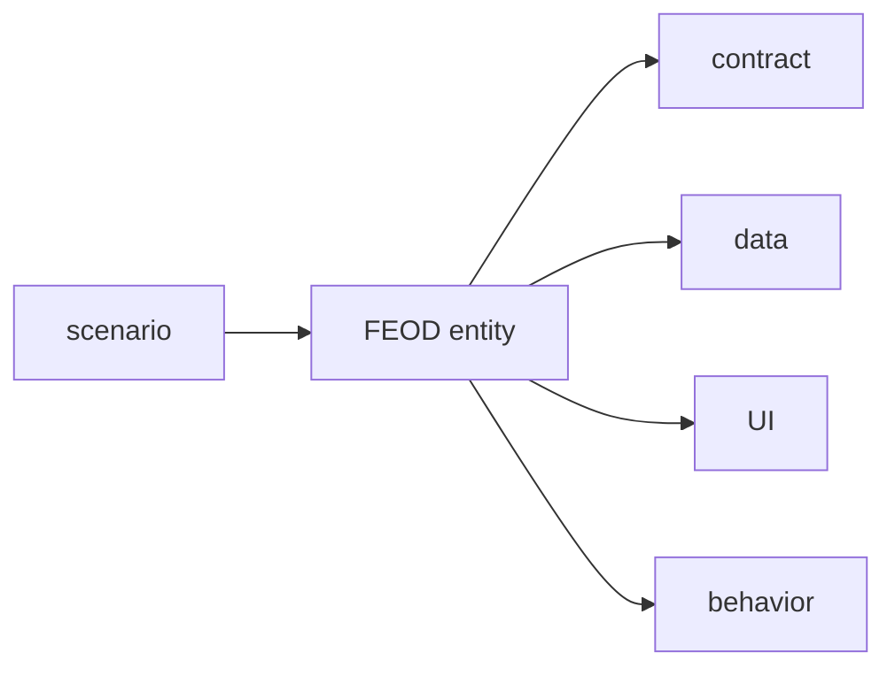

# Entity Orientation



## Short Definition

Entity orientation in FEOD means that every file and every directory is treated as a FEOD entity with a clear role. A FEOD entity is not the same as an `entity` from DDD: it is a structural unit whose role defines expectations and constraints.

## What Problem It Solves

Without this principle, the project structure quickly becomes a set of neutral folders and files where meaning has to be guessed from contents. In such a project, reviews, automated checks, and shared rules become harder.

## Rule

Every FEOD entity must have a clear role in the project structure. The role should indicate what is expected inside the entity, what is allowed there, and how it relates to neighboring entities.

Do not explain a FEOD entity through DDD. If a domain `entity` appears in the text, the distinction must be stated explicitly.

## Why

A role turns structure from a set of names into a set of verifiable expectations. When an author sees `index.ts`, they expect a `public API`. When an author sees `README.md`, they expect a description of purpose and boundaries. When an author sees `ui/`, they expect user interface code, not transport logic.

These expectations help during review. A role violation is visible before the error spreads through the codebase.

They also help automated checks. A linter, generator, or AI rule is easier to build around entity roles than around an informal feeling that "something is off here."

## Good example

```text
modules/
  profile/
    README.md
    index.ts
    ui/
      ProfileCard.tsx
    model/
      useProfile.ts
      profile.types.ts
    api/
      profile-client.ts
```

What is correct here:

- `profile/` is a module and defines an area of responsibility;
- `index.ts` has the role of `public API`;
- `README.md` has the role of describing boundaries and purpose;
- `ui/`, `model/`, and `api/` differ not only by name, but also by expected contents.

## Bad example

```text
modules/
  profile/
    stuff/
      index.ts
      helper.ts
      widget.tsx
      request.ts
```

Violation: the role of the `stuff/` entity is undefined, so the structure does not explain its purpose or constraints.

```text
modules/
  user/
    entity/
      User.ts
```

Violation: the term `entity` is used as if a FEOD entity were identical to a DDD entity, although these are different concepts.

## Common Mistakes

- Giving directories neutral names such as `stuff`, `misc`, or `shared` inside a module -> the entity role becomes unclear.
- Putting files that manage transport logic or data storage into `ui/` -> the folder role no longer matches the expectation.
- Describing a FEOD entity as a domain `entity` -> the reader projects another model onto the structure and mixes up the terms.
- Treating a file only as a technical container -> without a role, it is harder to agree on acceptable contents.
- Ignoring roles during review -> structural violations are noticed too late.

## Exceptions

There are no exceptions to the principle itself. If the entity role cannot be named briefly and explicitly, the structure needs to be rebuilt.

Project-specific roles beyond the base folders are acceptable if their meaning is stable and the team can formulate expectations and constraints as explicitly as it can for `index.ts`, `ui/`, or `README.md`.

## Related Pages

- [Modularity](./modularity.md)
- [Terms](../reference/terms.md)
- [Glossary](../reference/glossary.md)
