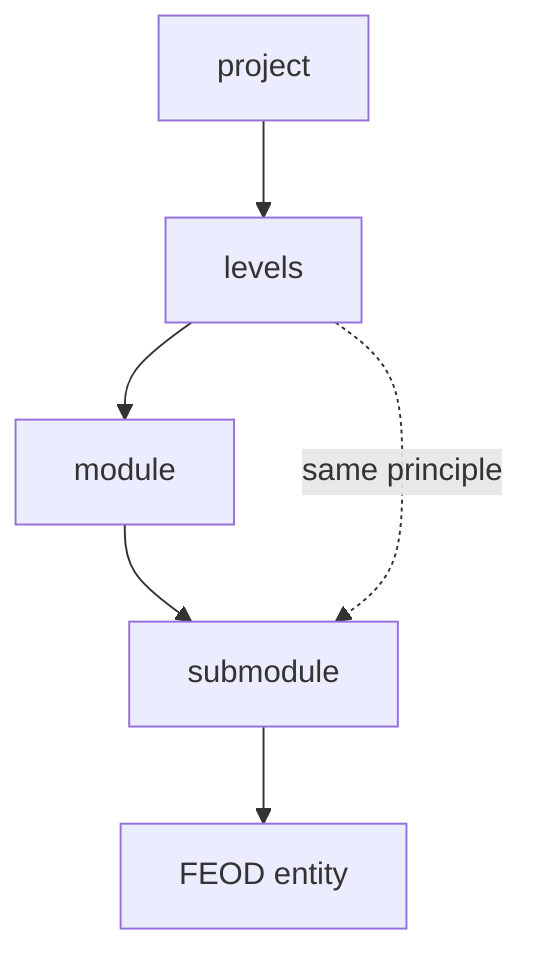

# Fractality



## Short Definition

Fractality in FEOD means that a module can evolve internally using the same principles that organize the project as a whole. If a separate area of responsibility appears inside a module, it can be shaped as a submodule with its own structure and local contract.

## What Problem It Solves

Without fractality, a large module either swells into a flat folder or gets split into separate top-level modules too early. In both cases, the structure stops reflecting real responsibility boundaries and makes navigation harder.

## Rule

Grow a module's structure gradually. If a stable subtask appears inside a module, shape it as a submodule with its own area of responsibility.

A submodule does not automatically become part of the whole project's `public API`. Nesting deeper than two or three levels is allowed only as an exception and requires explicit justification.

## Why

Fractality keeps the same way of thinking across different scales. The author does not need to invent a new organization system just because a module grew.

Growing structure gradually reduces premature complexity. A flat structure is enough at first, and submodules appear only where real responsibility confirms the need.

The depth limit protects the project from bureaucratic nesting. The deeper the tree, the harder it is to understand where the module boundary is and what is actually allowed to be used from it.

## Good example

The `checkout` module grew, and an independent `delivery` area emerged inside it.

```text
modules/
  checkout/
    index.ts
    ui/
      CheckoutPage.tsx
    delivery/
      index.ts
      ui/
        DeliveryForm.tsx
      model/
        useDeliveryOptions.ts
      lib/
        map-delivery-slots.ts
    payment/
      index.ts
      ui/
        PaymentForm.tsx
      model/
        usePaymentMethods.ts
```

```ts
// modules/checkout/index.ts
export { CheckoutPage } from "./ui/CheckoutPage";
export { DeliveryForm } from "./delivery";
export { PaymentForm } from "./payment";
```

What is correct here:

- the `delivery` and `payment` submodules appeared as separate areas inside one module;
- each submodule remains an independent internal FEOD entity;
- only what the parent module explicitly exported through its `index.ts` is open to the outside.

## Bad example

```text
modules/
  checkout/
    features/
      forms/
        delivery/
          parts/
            fields/
              base/
                index.ts
```

Violation: the structure became deep because of mechanical grouping, not because of separate areas of responsibility.

```ts
import { DeliveryForm } from "@/modules/checkout/delivery";
import { useDeliveryOptions } from "@/modules/checkout/delivery/model/useDeliveryOptions";
```

Violation: the submodule and its internal files are used as an external contract without an explicit export from the parent `public API`.

## Common Mistakes

- Extracting a submodule as soon as the first two files appear -> the structure becomes more complex before a separate responsibility exists.
- Leaving a large module flat when stable areas already exist inside it -> navigation and review become harder.
- Treating any `index.ts` inside a submodule as a public contract for the whole project -> it is only a local entry point until the parent opens it outward.
- Building a tree deeper than three levels for tidy folders -> depth starts hiding meaning instead of showing it.
- Moving a submodule to a separate top-level module too early -> the project gets extra external dependencies before real independence appears.

## Exceptions

Depth beyond two or three levels is acceptable if there is no other way to express stable internal boundaries and the structure remains readable for the team. This should be rare and must not turn technical groupings into pseudo-submodules.

A submodule can receive a separate external contract if the project explicitly documents it as an independent usage point. Until that decision exists, external code works only through the parent module's `index.ts`.

## Related Pages

- [Modularity](./modularity.md)
- [Public API](../reference/public-api.md)
- [Terms](../reference/terms.md)
- [Working with submodules](../guides/submodules.md)
