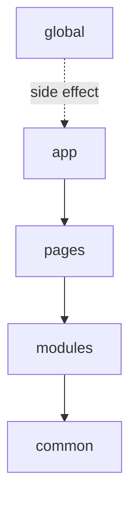

# Levels



## Short Definition

FEOD levels define the top-level structure of an application and the allowed dependencies between its parts. Each level has its own role, its own set of allowed imports, and its own prohibitions.

## What Problem It Solves

Without explicit levels, a project quickly loses boundaries. Pages start pulling module details directly, `common` turns into a dumping ground, and global infrastructure gets mixed with application code.

## Rule

FEOD uses only the `app`, `pages`, `modules`, `common`, and `global` levels. Code at each level must contain only that level's responsibility and depend only on the levels allowed by the import matrix.

## Why

Levels make structure predictable. From a file path, you can quickly understand the file's role, allowed dependencies, and place in review.

## Quick Reference

| Level | Purpose | Who can import it | What this level can import |
| --- | --- | --- | --- |
| `app` | application composition and startup | no one | `pages`, `modules`, `common` |
| `pages` | user screens and routes | `app` | `modules`, `common` |
| `modules` | product scenarios and isolated capabilities | `app`, `pages`, other `modules` | `common`, public API of other modules, public API of its own submodules |
| `common` | reusable technical and UI entities with no product binding | `app`, `pages`, `modules`, other `common` entities | public API of other `common` entities, external packages |
| `global` | global effects and infrastructure connections | no one directly | nothing from FEOD levels |

## `app` Level

### Purpose

`app` assembles the application into a whole. It contains the entrypoint, root composition, bootstrap, top-level routing, application providers, and wiring between major system parts.

### Who Can Import It

`app` is not imported from other levels.

### What It Can Import

`app` can import `pages`, `modules`, and `common`.

`app` does not import `global` as an application dependency and does not reach into internals of other pages or modules.

### What It Must Not Contain

`app` must not contain:

- logic for a specific page;
- internal logic of a specific module;
- domain-specific helpers that should live in a module;
- arbitrary reusable utilities if they are not related to application composition.

### Good example

```ts
import { AppRouter } from "@/pages";
import { ErrorBoundary } from "@/common/error-boundary";
import { AuthSessionProvider } from "@/modules/auth";

export function App() {
  return (
    <ErrorBoundary>
      <AuthSessionProvider>
        <AppRouter />
      </AuthSessionProvider>
    </ErrorBoundary>
  );
}
```

### Bad example

```ts
import { getUserDisplayName } from "@/modules/user/lib/getUserDisplayName";

export const appTitle = getUserDisplayName();
```

Violation: `app` performs a deep import into module internals and turns module logic into part of application composition.

### Common Mistakes

- Putting product business logic in `app` instead of a module -> `app` becomes a second `modules`.
- Importing internal files of a page or module -> the public API contract breaks.
- Storing shared helpers here "just in case" -> the boundary between `app` and `common` becomes blurred.

## `pages` Level

### Purpose

`pages` stores screens, route-level composition, and scenarios that exist in the context of a specific route or view.

### Who Can Import It

The `pages` level can be imported only from `app`.

### What It Can Import

Code at the `pages` level can import `modules` and `common`.

`pages` does not import `app`, `global`, other pages, or internals of other modules.

### What It Must Not Contain

`pages` must not contain:

- a shared product scenario used on several pages;
- global application initialization;
- code that should be an independent module;
- shared technical entities with no page binding.

### Good example

```ts
import { ProductList } from "@/modules/catalog";
import { PageLayout } from "@/common/page-layout";

export function CatalogPage() {
  return (
    <PageLayout title="Catalog">
      <ProductList />
    </PageLayout>
  );
}
```

### Bad example

```ts
import { CheckoutPage } from "@/pages/checkout";
import { ProductList } from "@/modules/catalog/ui/ProductList";
```

Violation: the page depends on another page and bypasses the module's public API.

### Common Mistakes

- Duplicating the same user scenario across several pages instead of extracting a module -> the logic starts diverging.
- Importing a page into a page -> routes become directly coupled.
- Putting reusable UI with no screen binding into `pages` -> this is effectively `common` or `modules` code.

## `modules` Level

### Purpose

`modules` stores product capabilities, user scenarios, and isolated parts of the domain. This is the main level for FEOD application logic.

### Who Can Import It

The `modules` level can be imported from `app`, `pages`, and other `modules`.

### What It Can Import

Code at the `modules` level can import `common`, public API of other modules, and public API of its own submodules.

`modules` does not import `app`, `pages`, `global`, or internals of other modules.

### What It Must Not Contain

`modules` must not contain:

- global side effects and bootstrap;
- route-level page composition;
- technical shared entities with no product meaning;
- public contracts of other modules copied locally instead of imported through their API.

### Good example

```ts
import { Button } from "@/common/button";
import { getUserDisplayName } from "@/modules/user";

export function InviteAuthorButton() {
  return <Button>{getUserDisplayName()}</Button>;
}
```

### Bad example

```ts
import { AppShell } from "@/app/AppShell";
import { CheckoutPage } from "@/pages/checkout";
import { normalizeUser } from "@/modules/user/lib/normalizeUser";
```

Violation: a module depends on `app`, `pages`, and internal files of another module.

### Common Mistakes

- Moving technical utilities with no product context into `modules` -> the `modules` level loses its product responsibility.
- Importing another module by a `ui`, `lib`, or `model` path -> the module contract stops being explicit.
- Making a page a thin wrapper over several related files in `pages` instead of a separate module -> the scenario loses reusability.

## `common` Level

### Purpose

`common` stores independent reusable FEOD entities without binding to a specific product capability. Typically this includes base UI, utilities, infrastructure adapters, formatters, and other shared contracts.

### Who Can Import It

The `common` level can be imported from `app`, `pages`, `modules`, and other `common` entities.

### What It Can Import

Code at the `common` level can import public API of other `common` entities and external packages.

`common` does not import `app`, `pages`, `modules`, `global`, or internals of other `common` entities.

### What It Must Not Contain

`common` must not contain:

- product scenarios or domain logic;
- dependencies on specific modules or pages;
- global effects from the `global` level;
- internals of a neighboring `common` entity that someone relies on through a deep import.

### Good example

```ts
import { clsx } from "clsx";
import { colorToCssVar } from "@/common/color";

export function badgeClassName(color: string) {
  return clsx("badge", colorToCssVar(color));
}
```

### Bad example

```ts
import { getCartSummary } from "@/modules/cart";
import { colorToCssVar } from "@/common/color/lib/colorToCssVar";
```

Violation: `common` depends on a product module and performs a deep import into another `common` entity's internals.

### Common Mistakes

- Putting everything used more than once into `common` -> the level turns into a dumping ground.
- Hiding domain dependencies on modules in `common` -> the architectural direction breaks from the bottom up.
- Exporting internal `common` files through random paths -> the boundary of independent entities is lost.

## `global` Level

### Purpose

`global` stores code that affects the entire application: shims, polyfills, global environment declarations, runtime initialization, and rare side-effect connections.

### Who Can Import It

`global` is not imported directly from `app`, `pages`, `modules`, or `common`.

### What It Can Import

`global` imports nothing from FEOD levels.

`global` is connected through an entrypoint, bundler configuration, HTML template, or another infrastructure mechanism of the project.

### What It Must Not Contain

`global` must not contain:

- regular application helpers;
- public API for modules and pages;
- code that depends on `app`, `pages`, `modules`, or `common`;
- product scenarios, UI, or business logic.

### Good example

```ts
import "focus-visible";
import "./styles.css";
```

### Bad example

```ts
import { getOrder } from "@/modules/order";

export const env = {
  order: getOrder,
};
```

Violation: `global` depends on a product level and tries to become an application contract.

### Common Mistakes

- Putting everything "needed everywhere" into `global` -> this is almost always a sign of the wrong level.
- Exporting variables and helpers from `global` for application code -> `global` becomes a hidden `common`.
- Importing `global` directly from modules and pages -> a global side effect enters the product dependency graph.

## Exceptions

Exceptions are allowed only where the import matrix already allows them: an entrypoint may connect global styles or polyfills before the application starts, while build-time and test-time infrastructure may use separate service connections outside the runtime graph.

## Related Pages

- [Dependency rules](./dependency-rules.md)
- [Import matrix](../reference/import-matrix.md)
- [Public API](../reference/public-api.md)
- [Terms](../reference/terms.md)
