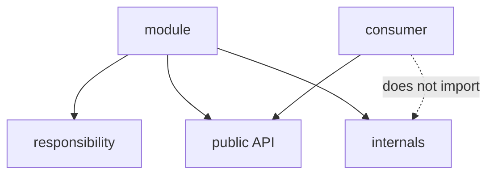

# Modularity



## Short Definition

Modularity in FEOD means that a module is a self-contained unit with a clear area of responsibility. A module has its own internal structure, local logic, and an explicit `public API` exposed through `index.ts`.

## What Problem It Solves

Without modularity, a project quickly turns into a set of files with no clear boundaries. In that kind of project, it is hard to tell where one responsibility ends and another begins, and reuse starts leaking through random deep imports.

## Rule

Create a module when the project has an independent area of responsibility that needs to be developed, tested, and used as a single whole. External code must work with the module only through its `public API`, while the module's internal files must remain private.

Do not create a module for one random file, a temporary grouping, or a technical navigation convenience.

A component is a separate UI entity, a page is responsible for a user route or screen, and `common` stores truly shared entities that are not tied to one domain area. A module has a different role: it gathers everything needed for one responsibility to work.

## Why

A module localizes change. When UI, model, integrations, and tests for one responsibility live together, they are easier to change and review together.

An explicit `public API` through `index.ts` separates the contract from the implementation. That lets the team freely reshape the module internals as long as the same public entry point remains stable.

A module README and local tests fix the module's purpose in artifacts, not in verbal agreements. This keeps the module understandable as a FEOD entity even after the project grows.

## Good example

The `notifications` module solves one task: showing, storing, and updating user notifications.

```text
modules/
  notifications/
    README.md
    index.ts
    ui/
      NotificationsBell.tsx
      NotificationsPanel.tsx
    model/
      useNotifications.ts
      notifications-store.ts
      notifications.types.ts
    api/
      notifications-client.ts
    lib/
      group-notifications.ts
    __tests__/
      notifications-store.test.ts
```

```ts
// modules/notifications/index.ts
export { NotificationsBell } from "./ui/NotificationsBell";
export { NotificationsPanel } from "./ui/NotificationsPanel";
export { useNotifications } from "./model/useNotifications";

export type { NotificationItem } from "./model/notifications.types";
```

What is correct here:

- the module owns one area;
- `index.ts` defines the `public API`;
- `lib`, `api`, and `model` remain internal;
- README records the purpose and boundaries;
- tests live next to the area of responsibility.

## Bad example

```text
modules/
  common-ui/
    Button.tsx
    Modal.tsx
    useDebounce.ts
    auth-api.ts
    user-store.ts
    order-mapper.ts
```

Violation: the directory is called a module, but it does not describe one independent responsibility and mixes unrelated entities.

```ts
import { userStore } from "@/modules/profile/user-store";
import { authApi } from "@/modules/profile/auth-api";
```

Violation: external code goes into the module's internal files instead of the `public API`.

## Common Mistakes

- Creating a module for one component with no responsibility of its own -> this is usually a component, not a module.
- Turning a page into a module just because the screen is large -> pages and modules solve different problems.
- Calling a folder of unrelated utilities a module -> that folder does not provide a responsibility boundary.
- Moving domain code into `common` because it is needed in two places -> a shared import does not by itself cancel ownership by a specific responsibility.
- Exporting almost everything from `index.ts` -> the `public API` starts reflecting the file structure instead of the contract.
- Storing shared internal module files in `common` -> the module loses locality and starts leaking outward.
- Leaving a module without a README when its purpose is not obvious -> the next author has to spend more time understanding its boundaries and usage rules.
- Testing a module only through pages and having no local tests for its behavior -> errors are harder to localize inside the responsibility itself.

## Exceptions

A small module without `README.md` is acceptable if its purpose is clear from its name, structure, and `public API`, and the team does not lose context because of it. This exception does not remove the requirement for an explicit responsibility and does not make deep imports acceptable.

A temporary migration module is acceptable if it already has a clear boundary and a simplification plan. Being temporary does not justify mixing several independent areas in one module.

## Related Pages

- [Public API](../reference/public-api.md)
- [Terms](../reference/terms.md)
- [Code smells](../reference/code-smells.md)
