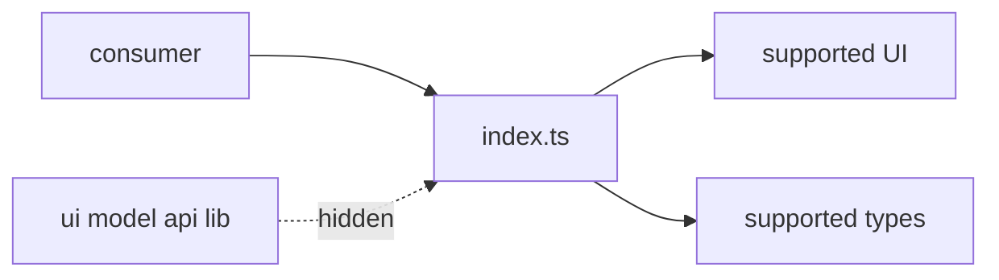

# Public API



## Short Definition

The public API of a FEOD entity is the explicit supported entry point through which external code can use that entity. For a module, this entry point is usually the root `index.ts`.

## What Problem It Solves

Without a public API, consumers start importing internal files. After that, moving a component, renaming a hook, or splitting a model becomes a breaking change for the whole project.

## Rule

External code must use a module through its public API. A module's internal files are not a contract for external consumers.

## Why

Public API separates intent from implementation. The team can see what the module promises to support and can change the internal structure without rewriting every consumer.

## Good example

```ts
// src/modules/user/index.ts
export { UserCard } from './ui/user-card';
export { useUser } from './model/use-user';
export type { User } from './model/types';
```

```ts
// src/pages/profile/ui/profile-page.tsx
import { UserCard, useUser } from '@/modules/user';
```

The consumer depends on the module contract, not on its internal structure.

## Bad example

```ts
// src/pages/profile/ui/profile-page.tsx
import { UserCard } from '@/modules/user/ui/user-card';
import { useUser } from '@/modules/user/model/use-user';
```

Violation: the page bypasses the public API and turns the module's internal paths into an external contract.

## Common Mistakes

- Exporting everything through `export *` -> accidental internal details leak outward.
- Keeping the public API only in README -> code imports still bypass the contract.
- Treating any `index.ts` as public for the whole project -> a submodule's `index.ts` may be only a local entry point inside its parent.
- Exporting debug components together with user-facing components -> temporary implementation becomes supported API.

## Exceptions

Exceptions are allowed only inside the FEOD entity itself. Internal files of a module may import each other directly as long as this does not cross the module boundary.

## Related Pages

- [Public API](../reference/public-api.md)
- [Module contract](../reference/module-contract.md)
- [Import matrix](../reference/import-matrix.md)
- [Code smells](../reference/code-smells.md)
