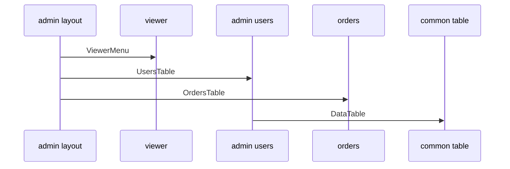

# Example: Dashboard / Admin Panel



## Goal of the Example

This example demonstrates an FEOD structure for a dashboard or admin panel: layout, nested pages, multiple product modules, shared table/filter primitives, and page-level composition.

The example is not a tutorial specific to any framework. It captures architectural boundaries and typical imports.

## Scenarios

The admin panel supports:

- A common layout with navigation;
- An overview page;
- User management;
- Order viewing;
- Audit log;
- Filtering and tables in multiple sections.

## Project Structure

```text
src/
  app/
    main.tsx
    App.tsx
    router/
      admin-routes.ts
    providers/
      QueryProvider.tsx
      AuthProvider.tsx
  pages/
    admin-layout/
      index.ts
      ui/AdminLayout.tsx
    dashboard/
      index.ts
      ui/DashboardPage.tsx
    users/
      index.ts
      ui/UsersPage.tsx
    orders/
      index.ts
      ui/OrdersPage.tsx
    audit-log/
      index.ts
      ui/AuditLogPage.tsx
  modules/
    viewer/
      index.ts
      ui/ViewerMenu.tsx
      model/useCurrentViewer.ts
      api/viewer-client.ts
      types.ts
    admin-users/
      README.md
      index.ts
      ui/UsersTable.tsx
      ui/UserStatusBadge.tsx
      model/useUsers.ts
      model/user-filters.ts
      api/users-client.ts
      types.ts
    orders/
      index.ts
      ui/OrdersTable.tsx
      ui/OrderStatusBadge.tsx
      model/useOrders.ts
      api/orders-client.ts
      types.ts
    audit-log/
      index.ts
      ui/AuditLogTable.tsx
      model/useAuditLog.ts
      api/audit-log-client.ts
      types.ts
  common/
    ui/
      data-table/
        index.ts
        DataTable.tsx
      filters-panel/
        index.ts
        FiltersPanel.tsx
      button/
        index.ts
        Button.tsx
    date-range/
      index.ts
      DateRange.tsx
    format-date/
      index.ts
      formatDate.ts
  global/
    env.d.ts
    polyfills/
      intersection-observer.ts
```

## Level Roles

`app` launches the application, connects providers and router.

`pages/admin-layout` describes a route-level layout: navigation, content area, breadcrumbs. This is page-level composition, not `common`, because the layout is tied to a specific section of the application.

`modules` own product areas: viewer, admin-users, orders, audit-log.

`common` stores neutral table/filter primitives. They are unaware of users, orders, or audit events.

`global` contains only declarations and infrastructure connections.

## Public APIs of Modules

```ts
// modules/viewer/index.ts
export { ViewerMenu } from "./ui/ViewerMenu";
export { useCurrentViewer } from "./model/useCurrentViewer";
export type { Viewer } from "./types";
```

```ts
// modules/admin-users/index.ts
export { UsersTable } from "./ui/UsersTable";
export { UserStatusBadge } from "./ui/UserStatusBadge";
export { useUsers } from "./model/useUsers";
export type { AdminUser, UserFilter } from "./types";
```

```ts
// modules/orders/index.ts
export { OrdersTable } from "./ui/OrdersTable";
export { OrderStatusBadge } from "./ui/OrderStatusBadge";
export { useOrders } from "./model/useOrders";
export type { Order, OrderFilter } from "./types";
```

```ts
// modules/audit-log/index.ts
export { AuditLogTable } from "./ui/AuditLogTable";
export { useAuditLog } from "./model/useAuditLog";
export type { AuditLogEvent } from "./types";
```

## Layout and Pages

### App

```ts
import { AppRouter } from "@/pages";
import { AuthProvider } from "./providers/AuthProvider";
import { QueryProvider } from "./providers/QueryProvider";

export function App() {
  return (
    <QueryProvider>
      <AuthProvider>
        <AppRouter />
      </AuthProvider>
    </QueryProvider>
  );
}
```

### Admin Layout Page

```ts
import { ViewerMenu } from "@/modules/viewer";
import { Button } from "@/common/ui/button";

export function AdminLayout({ children }: { children: unknown }) {
  return (
    <section>
      <nav>
        <Button>Dashboard</Button>
        <Button>Users</Button>
        <Button>Orders</Button>
      </nav>
      <ViewerMenu />
      <main>{children}</main>
    </section>
  );
}
```

The layout is in `pages` because it is bound to the admin panel's route tree. It does not become `common` just due to repeated use by multiple admin pages.

### Users Page

```ts
import { UsersTable } from "@/modules/admin-users";
import { FiltersPanel } from "@/common/ui/filters-panel";

export function UsersPage() {
  return (
    <>
      <FiltersPanel />
      <UsersTable />
    </>
  );
}
```

### Orders Page

```ts
import { OrdersTable } from "@/modules/orders";
import { DateRange } from "@/common/date-range";

export function OrdersPage() {
  return (
    <>
      <DateRange />
      <OrdersTable />
    </>
  );
}
```

Pages assemble the scenario using module public APIs and neutral `common` contracts. They do not work with raw module clients.

## Shared Table/Filter Components

`DataTable`, `FiltersPanel`, and `DateRange` can live in `common` as long as they are unaware of domain types.

Correct:

```ts
import { DataTable } from "@/common/ui/data-table";
```

Incorrect:

```ts
import { UserStatusBadge } from "@/common/ui/data-table";
import type { AdminUser } from "@/common/ui/data-table";
```

Violation: The table primitive began to store product UI and domain types.

## Allowed Imports

```ts
import { UsersTable } from "@/modules/admin-users";
import { OrdersTable } from "@/modules/orders";
import { ViewerMenu } from "@/modules/viewer";
import { DataTable } from "@/common/ui/data-table";
```

## Forbidden Imports

```ts
import { usersClient } from "@/modules/admin-users/api/users-client";
import { orderFilters } from "@/modules/orders/model/order-filters";
import { AdminLayout } from "@/pages/admin-layout";
import "@/global/polyfills/intersection-observer";
```

Violations:

- External code depends on transport details of a module;
- A page or module imports the internal model part of another module;
- `pages` import another page as a regular dependency;
- `global` is included as an application contract outside the infrastructure entry point.

## When Admin Code Should Not Go to Common

Do not move into `common`:

- `UserStatusBadge`;
- `OrderStatusBadge`;
- `useUsers`;
- `useOrders`;
- `AdminLayout`, if it is tied to the admin route tree;
- filters that know about user or order statuses.

These entities have a product-specific meaning. Their place is in the corresponding module or page.

## Example Checklist

- [ ] `app` contains router/providers/bootstrap.
- [ ] Admin panel layout is at the `pages` level.
- [ ] Each product area has a module with an `index.ts`.
- [ ] Tables and filters in `common` remain neutral primitives.
- [ ] Pages import modules through public API.
- [ ] Modules do not import `pages`, `app`, or `global`.
- [ ] The example shows forbidden deep imports.

## Related Pages

- [Pages](../structure/pages.md)
- [Modules](../structure/modules.md)
- [Common](../structure/common.md)
- [How to Avoid Common Becoming a Dumping Ground](../guides/common-boundaries.md)
- [Import Matrix](../reference/import-matrix.md)
- [Code Smells](../reference/code-smells.md)
