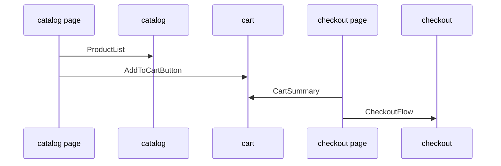

# Example: E-commerce



## Goal of the Example

This example demonstrates a complete FEOD scaffold for an e-commerce application: catalog, cart, checkout, and user data.

The example is not tied to any specific framework or state manager. The important parts are the boundaries between `app`, `pages`, `modules`, `common`, and `global`, plus the public APIs of modules.

## Scenarios

The application supports:

- browsing the catalog;
- adding a product to the cart;
- viewing the cart;
- placing an order;
- displaying user data.

## Project Structure

```text
src/
  app/
    main.tsx
    App.tsx
    router/
      routes.ts
    providers/
      QueryProvider.tsx
  pages/
    catalog/
      index.ts
      ui/CatalogPage.tsx
    cart/
      index.ts
      ui/CartPage.tsx
    checkout/
      index.ts
      ui/CheckoutPage.tsx
    profile/
      index.ts
      ui/ProfilePage.tsx
  modules/
    catalog/
      index.ts
      ui/ProductList.tsx
      ui/ProductCard.tsx
      model/useCatalog.ts
      api/catalog-client.ts
      types.ts
    cart/
      index.ts
      ui/CartSummary.tsx
      ui/AddToCartButton.tsx
      model/useCart.ts
      model/cart-store.ts
      types.ts
    checkout/
      index.ts
      ui/CheckoutFlow.tsx
      ui/DeliveryStep.tsx
      ui/PaymentStep.tsx
      model/useCheckout.ts
      api/checkout-client.ts
      types.ts
    user/
      index.ts
      ui/UserMenu.tsx
      model/useCurrentUser.ts
      api/user-client.ts
      types.ts
  common/
    ui/
      button/
        index.ts
        Button.tsx
      page-layout/
        index.ts
        PageLayout.tsx
    format-money/
      index.ts
      formatMoney.ts
  global/
    env.d.ts
    polyfills/
      resize-observer.ts
```

## Public APIs of Modules

```ts
// modules/catalog/index.ts
export { ProductList } from "./ui/ProductList";
export type { Product, ProductId } from "./types";
```

```ts
// modules/cart/index.ts
export { AddToCartButton } from "./ui/AddToCartButton";
export { CartSummary } from "./ui/CartSummary";
export { useCart } from "./model/useCart";
export type { CartItem } from "./types";
```

```ts
// modules/checkout/index.ts
export { CheckoutFlow } from "./ui/CheckoutFlow";
export type { CheckoutDraft } from "./types";
```

```ts
// modules/user/index.ts
export { UserMenu } from "./ui/UserMenu";
export { useCurrentUser } from "./model/useCurrentUser";
export type { User } from "./types";
```

## Pages and Module Interaction

### Catalog page

```ts
import { ProductList } from "@/modules/catalog";
import { AddToCartButton } from "@/modules/cart";
import { PageLayout } from "@/common/ui/page-layout";

export function CatalogPage() {
  return (
    <PageLayout title="Catalog">
      <ProductList renderAction={(product) => (
        <AddToCartButton productId={product.id} />
      )} />
    </PageLayout>
  );
}
```

The page assembles the scenario from modules. It does not import internal API clients of catalog or cart.

### Cart page

```ts
import { CartSummary } from "@/modules/cart";
import { PageLayout } from "@/common/ui/page-layout";

export function CartPage() {
  return (
    <PageLayout title="Cart">
      <CartSummary />
    </PageLayout>
  );
}
```

### Checkout page

```ts
import { CheckoutFlow } from "@/modules/checkout";
import { CartSummary } from "@/modules/cart";
import { PageLayout } from "@/common/ui/page-layout";

export function CheckoutPage() {
  return (
    <PageLayout title="Checkout">
      <CartSummary />
      <CheckoutFlow />
    </PageLayout>
  );
}
```

## User Data Boundary

User data belongs to the `user` module. Other modules do not read internal stores or API clients of `user` directly.

Correct:

```ts
import { useCurrentUser } from "@/modules/user";
```

Incorrect:

```ts
import { userStore } from "@/modules/user/model/user-store";
import { userClient } from "@/modules/user/api/user-client";
```

Violation: External code depends on internal state and transport details of the `user` module.

## Interaction between catalog and cart

`catalog` should not import internal parts of `cart`, and `cart` should not know about the internal API of `catalog`.

Allowed:

```ts
import { AddToCartButton } from "@/modules/cart";
import type { ProductId } from "@/modules/catalog";
```

Forbidden:

```ts
import { cartStore } from "@/modules/cart/model/cart-store";
import { ProductCard } from "@/modules/catalog/ui/ProductCard";
```

Violation: Both imports bypass the public API.

## Where is `common` here

`common` contains neutral entities:

- `Button`;
- `PageLayout`;
- `formatMoney`.

`common` does not contain `CartSummary`, `ProductCard`, `CheckoutFlow`, or `UserMenu` because they are product-specific entities of specific modules.

## Where is `global` here

`global` contains only declarations and infrastructure connections:

- `env.d.ts`;
- polyfills;
- global side-effect files, if they are imported by the entrypoint.

`global` does not contain `env.ts`, `formatMoney`, UI or API clients.

## Example Checklist

- [ ] `app` launches the application and assembles providers/router.
- [ ] `pages` assemble user scenarios from modules.
- [ ] `modules` own product areas: `catalog`, `cart`, `checkout`, `user`.
- [ ] Each module has an `index.ts`.
- [ ] External code imports only through public API.
- [ ] `common` contains only neutral, reusable entities.
- [ ] `global` is not used as a hidden common dumping ground.

## Related Pages

- [Modules](../structure/modules.md)
- [Pages](../structure/pages.md)
- [Public API](../reference/public-api.md)
- [Import Matrix](../reference/import-matrix.md)
- [Code Smells](../reference/code-smells.md)
