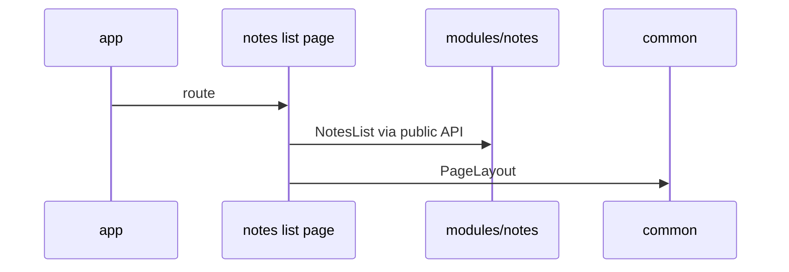

# Example: Minimal SPA



## Goal of the Example

This example shows the smallest useful FEOD scaffold for a SPA: `app`, two pages, one product module, several neutral `common` entities, and minimal `global`.

The example is not tied to any specific framework or state manager. File names are illustrative; what matters are boundaries and imports.

## Scenario

The application displays a list of notes and a page with details for a single note.

Minimal areas:

- `app` launches the app and connects the router;
- `pages` describe route-level screens;
- `modules/notes` owns the notes;
- `common` stores UI primitives and neutral helpers;
- `global` stores declarations and polyfills.

## Project Structure

```text
src/
  app/
    main.tsx
    App.tsx
    router/
      routes.ts
  pages/
    notes-list/
      index.ts
      ui/NotesListPage.tsx
    note-details/
      index.ts
      ui/NoteDetailsPage.tsx
  modules/
    notes/
      index.ts
      ui/NotesList.tsx
      ui/NoteCard.tsx
      ui/NoteDetails.tsx
      model/useNotes.ts
      model/useNote.ts
      api/notes-client.ts
      types.ts
  common/
    ui/
      button/
        index.ts
        Button.tsx
      page-layout/
        index.ts
        PageLayout.tsx
    format-date/
      index.ts
      formatDate.ts
  global/
    vite-env.d.ts
    polyfills/
      resize-observer.ts
```

## Public API of the Module

```ts
// modules/notes/index.ts
export { NotesList } from "./ui/NotesList";
export { NoteDetails } from "./ui/NoteDetails";
export { useNote } from "./model/useNote";

export type { Note, NoteId } from "./types";
```

The module does not export `notes-client`, internal mappers, or part components unless they are part of the external contract.

## App

```ts
import { AppRouter } from "@/pages";

export function App() {
  return <AppRouter />;
}
```

`app` assembles the application and can import `pages`, `modules`, and `common`. It should not perform deep imports into module internals.

## Pages

### Notes list page

```ts
import { NotesList } from "@/modules/notes";
import { PageLayout } from "@/common/ui/page-layout";

export function NotesListPage() {
  return (
    <PageLayout title="Notes">
      <NotesList />
    </PageLayout>
  );
}
```

### Note details page

```ts
import { NoteDetails } from "@/modules/notes";
import { PageLayout } from "@/common/ui/page-layout";

export function NoteDetailsPage({ noteId }: { noteId: string }) {
  return (
    <PageLayout title="Note">
      <NoteDetails noteId={noteId} />
    </PageLayout>
  );
}
```

Pages assemble the route-level scenario. They do not import `api/notes-client` or read internal module state.

## Allowed Imports

```ts
import { NoteDetails, NotesList } from "@/modules/notes";
import { PageLayout } from "@/common/ui/page-layout";
import { formatDate } from "@/common/format-date";
```

## Forbidden Imports

```ts
import { notesClient } from "@/modules/notes/api/notes-client";
import { NoteCard } from "@/modules/notes/ui/NoteCard";
import "@/global/polyfills/resize-observer";
```

Violations:

- The page depends on transport details of the module;
- External code imports a parts component from an internal folder;
- Application code imports `global` as a regular dependency.

Global polyfills are only imported through entrypoint, test setup, or build/runtime configuration of the project.

## Where `common` Fits

`PageLayout`, `Button`, and `formatDate` are neutral: they do not know about notes and can be used in any scenario.

If a helper like `formatNotePreview` appears, it belongs to `modules/notes` because it knows about the note domain model.

## Example Checklist

- [ ] `app` is responsible for launching and top-level composition.
- [ ] `pages` describe routes and assemble modular UI.
- [ ] `modules/notes` owns notes data and UI.
- [ ] Public API of the module is in `modules/notes/index.ts`.
- [ ] `common` contains only neutral entities.
- [ ] `global` is not imported as a regular application contract.
- [ ] The example does not perform deep imports into module internals.

## Related Pages

- [Quick Start](../get-started/quick-start.md)
- [Where to Place Code](../guides/where-to-place-code.md)
- [Import Matrix](../reference/import-matrix.md)
- [Public API](../reference/public-api.md)
- [Glossary](../reference/glossary.md)
