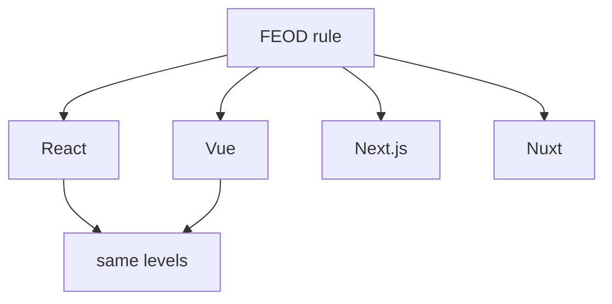

# Framework Appendices

Framework appendices show how to apply FEOD in popular frontend stacks. They do not change the methodology's basic rules.

## Rule

If a framework-specific recommendation conflicts with `Reference`, `Reference` has priority. An appendix can explain adaptation, but it does not create a new import or public API rule.

## Available appendices

- [React](./react.md)
- [Vue](./vue.md)
- [Next.js and Nuxt](./next-nuxt.md)

## What should not be here

- a new import matrix;
- separate level terminology;
- rules that apply only to one framework but are presented as a FEOD norm;
- bypassing public API for framework convenience.

## Related pages

- [Quick start](../get-started/quick-start.md)
- [Levels](../core-concepts/levels.md)
- [Import matrix](../reference/import-matrix.md)
