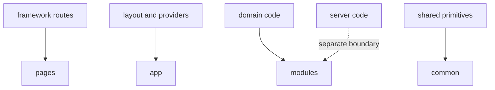

# Next.js and Nuxt

Next.js and Nuxt add filesystem routing and server-side capabilities. FEOD still remains the application's internal architecture, not a replacement for framework conventions.



## Main rule

Framework route files can be a thin adapter layer. Product logic and reusable scenarios should stay in `modules`, not in route files.

## Next.js

A typical option:

```text
src/
  app/                 # framework routes or bootstrap if the project uses App Router
  modules/
    catalog/
    cart/
  common/
  global/
```

If the name `app` is occupied by framework routing, the project should explicitly describe where the FEOD `app` level is located or how the framework `app` relates to it.

```tsx
// src/app/catalog/page.tsx
import { CatalogPage } from '@/pages/catalog';

export default function Page() {
  return <CatalogPage />;
}
```

The framework route remains an adapter layer, while the FEOD page stores route-level composition.

## Nuxt

A typical option:

```text
src/
  pages/               # framework routes
  modules/
    catalog/
    cart/
  common/
  global/
```

If the framework already uses `pages`, the team should document whether this directory is also FEOD `pages` or only a route adapter.

## Server code

Server handlers, loaders, and actions should not bypass FEOD contracts just because they run on the server. If server-side code uses a module, it should use its public API or a separate explicitly exported server contract.

## Good example

```ts
// modules/catalog/index.ts
export { CatalogPageContent } from './ui/catalog-page-content';
export { getProducts } from './server/get-products';
```

`getProducts` is exported intentionally as part of the server-facing contract.

## Bad example

```ts
// app/catalog/page.tsx
import { productRepository } from '@/modules/catalog/server/internal/product-repository';
```

Violation: the framework route bypasses the module's public API.

## Checklist

- Framework route files remain thin adapters.
- FEOD rules explicitly describe any `app` or `pages` naming conflict if it exists.
- Server-side imports do not bypass public API.
- Server-facing exports are separated from accidental internal files.
- `common` does not become a place for server business logic.

## Related pages

- [Public API](../reference/public-api.md)
- [Import matrix](../reference/import-matrix.md)
- [Is FEOD right for my project?](../get-started/is-feod-for-my-project.md)
