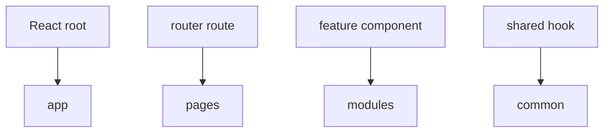

# React

This appendix shows a typical mapping between FEOD and a React application. The basic public API and import rules remain the same.



## App

`app` usually contains:

- React root;
- providers;
- router;
- top-level error boundary;
- global style imports.

```text
src/app/
  providers/
    app-providers.tsx
  router/
    router.tsx
  index.tsx
```

## Pages

Route-level React components live in `pages`.

```tsx
// src/pages/profile/ui/profile-page.tsx
import { ProfileCard } from '@/modules/profile';

export function ProfilePage() {
  return <ProfileCard />;
}
```

## Modules

React hooks, components, and the local scenario model live inside a module.

```text
src/modules/profile/
  ui/
    profile-card.tsx
  model/
    use-profile.ts
  index.ts
```

```ts
// src/modules/profile/index.ts
export { ProfileCard } from './ui/profile-card';
export { useProfile } from './model/use-profile';
```

## Common

`common` may contain neutral UI primitives and hooks without domain coupling.

```text
common/ui/button
common/hooks/use-media-query
common/lib/format-date
```

## Common mistakes

- Storing all hooks in `common/hooks` -> domain hooks lose their owner.
- Exporting internal React components of a module directly -> public API becomes blurred.
- Putting route-level state in `app` without need -> `app` starts knowing about a business scenario.

## Related pages

- [Public API](../reference/public-api.md)
- [Where to place code](../guides/where-to-place-code.md)
- [Code review checklist](../guides/code-review.md)
