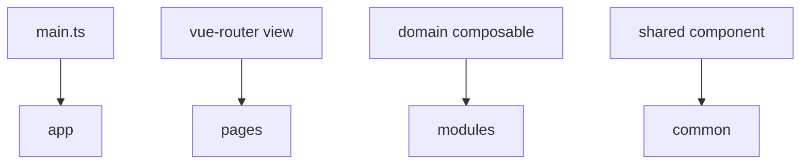

# Vue

This appendix shows a typical mapping between FEOD and a Vue application. FEOD does not require a different import matrix for Vue.



## App

`app` usually contains:

- Vue application creation;
- router;
- plugins;
- providers;
- global styles.

```text
src/app/
  router/
    router.ts
  plugins/
    index.ts
  index.ts
```

## Pages

Route-level `.vue` components live in `pages`.

```vue
<!-- src/pages/profile/ui/ProfilePage.vue -->
<script setup lang="ts">
import { ProfileCard } from '@/modules/profile';
</script>

<template>
  <ProfileCard />
</template>
```

## Modules

Components, composables, and the internal scenario model live inside a module.

```text
src/modules/profile/
  ui/
    ProfileCard.vue
  model/
    useProfile.ts
  index.ts
```

```ts
// src/modules/profile/index.ts
export { default as ProfileCard } from './ui/ProfileCard.vue';
export { useProfile } from './model/useProfile';
```

## Common

`common` may contain neutral composables, UI primitives, and helpers.

```text
common/ui/BaseButton
common/composables/useMediaQuery
common/lib/formatDate
```

## Common mistakes

- Putting all composables in `common` -> domain scenarios lose their module.
- Importing a `.vue` file from an internal directory of another module -> bypassing public API.
- Keeping business state in router guards without an explicit reason -> behavior becomes a hidden app-level side effect.

## Related pages

- [Import matrix](../reference/import-matrix.md)
- [Working with submodules](../guides/submodules.md)
- [Code smells](../reference/code-smells.md)
