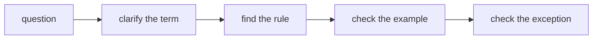

# FAQ

This page answers short frequently asked questions. Detailed rules live in `Core Concepts`, `Structure`, `Guides`, and `Reference`.



## Is FEOD FSD?

No. FEOD uses fewer top-level levels and builds the project around `modules`, public API, and controlled dependencies.

If a team is coming from FSD, first map existing `entities`, `features`, and `widgets` to future `modules`, then review the public API of each module.

More: [Migration from FSD](../guides/migration-from-fsd.md).

## Can I Use FEOD Without `common`?

Yes, if the project intentionally does not define a shared level. But neutral reusable code must then have another explicit place, and it must not drift into product modules by accident.

In the canonical FEOD structure, `common` exists, but it is not a folder for undefined code.

More: [Common](../structure/common.md).

## Can One Module Import Another Module?

Yes, as long as the import goes through the other module's public API and does not create a cyclic or hidden dependency.

```ts
// good
import { Money } from '@/modules/billing';

// bad
import { Money } from '@/modules/billing/model/money';
```

More: [Import Matrix](../reference/import-matrix.md).

## When Does a Submodule Become a Separate Module?

A submodule should be extracted when it has its own consumers, a separate responsibility, and a contract that is no longer just an internal detail of the parent module.

If the submodule is needed only by its parent, keep it inside.

More: [Working with Submodules](../guides/submodules.md).

## Can Modules Be Single-File?

Yes, if the responsibility is small and the public API remains clear. A single-file module should not become an excuse to bypass structure in larger scenarios.

More: [Modules](../structure/modules.md).

## Where Should an API Client Live?

An API client for a specific product area usually lives inside the corresponding module. A neutral HTTP wrapper with no domain knowledge may live in `common`.

More: [Where to Place Code](../guides/where-to-place-code.md).

## Should Every Module Have a README?

No. A small obvious module can rely on its name, structure, and public API. A README is useful when the module has non-trivial responsibility, several consumers, submodules, or dependency constraints.

More: [How to Write a Module README](../guides/module-readme.md).

## What Should I Do with Legacy Deep Imports?

Do not fix everything in one pass unless you have to. First extract a public API, then move consumers to it, and only after that close internal paths.

More: [Migration from Regular Modular Architecture](../guides/migration-from-modular.md).

## Can I Violate the Import Matrix?

An exception should be explicit and local. If the violation repeats, it is not an exception but a sign of an incorrect module or level boundary.

More: [Import Matrix](../reference/import-matrix.md) and [Code Smells](../reference/code-smells.md).
