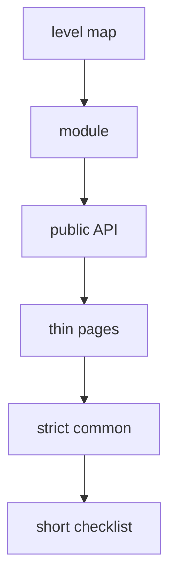

# FEOD in 5 Minutes

This page gives you the shortest path: understand levels, the public API, and the main import rule without reading the full documentation.



## 1. Learn the Level Map

```text
src/
  app/      # application assembly
  pages/    # route-level screens
  modules/  # product areas
  common/   # neutral reusable code
  global/   # declarations and application-wide side effects
```

The reading rule is simple: the lower a level is in this list, the less it should know about the specific application.

## 2. Start with a Module

A module is the main unit in FEOD. It owns a product responsibility and exposes only an explicit contract.

```text
src/modules/cart/
  ui/
    cart-summary.tsx
  model/
    use-cart.ts
  index.ts
```

```ts
// src/modules/cart/index.ts
export { CartSummary } from './ui/cart-summary';
export { useCart } from './model/use-cart';
```

External code uses only `@/modules/cart`.

## 3. Do Not Bypass the public API

Good:

```ts
import { CartSummary } from '@/modules/cart';
```

Bad:

```ts
import { CartSummary } from '@/modules/cart/ui/cart-summary';
```

Violation: external code depends on an internal module file.

## 4. Keep pages Thin

`pages` compose a user scenario from modules and common entities.

```tsx
// src/pages/cart/ui/cart-page.tsx
import { CartSummary } from '@/modules/cart';
import { CheckoutButton } from '@/modules/checkout';

export function CartPage() {
  return (
    <main>
      <CartSummary />
      <CheckoutButton />
    </main>
  );
}
```

A page should not become the source of business logic reused by other parts of the project.

## 5. Review common More Strictly Than Usual

Code belongs in `common` only if it does not know about a product area.

```text
common/ui/button       # good
common/lib/formatDate  # good
common/cart/helpers    # bad
```

Violation: `common/cart` hides domain responsibility inside the shared level.

## 6. Use a Short Checklist

- Every module has a clear responsibility.
- External code imports a module through `@/modules/<name>`.
- `pages` do not export reusable business logic.
- `common` does not contain domain scenarios.
- `global` does not contain imported helpers.

## Next

- [Quick Start](./quick-start.md)
- [Where to Place Code](../guides/where-to-place-code.md)
- [Import Matrix](../reference/import-matrix.md)
- [Public API](../reference/public-api.md)
