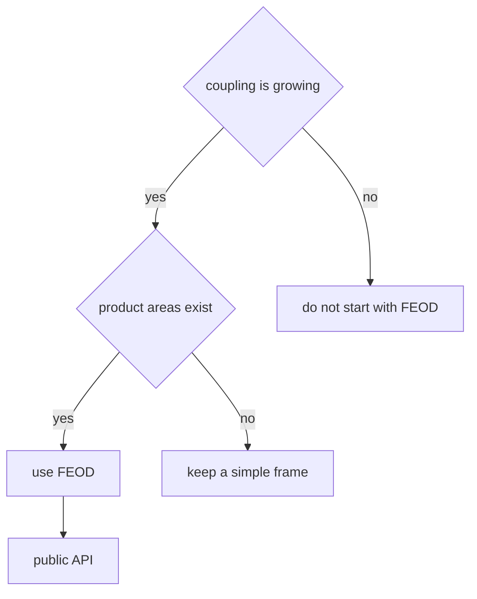

# Is FEOD Right for My Project?

FEOD is useful when a frontend project needs a manageable module structure, public API, and verifiable dependencies. The methodology is not mandatory for every interface.



## When to Use It

Use FEOD if the project has at least several of these signs:

- the application will grow beyond one short release;
- several developers change the same code areas;
- there are business scenarios that need isolation;
- deep imports already break refactoring;
- `shared`, `common`, or `utils` have become a place for everything;
- the team wants to verify architecture in review or lint rules.

## When Not to Start with FEOD

FEOD may be unnecessary if:

- this is a one-off prototype with no maintenance horizon;
- the whole frontend fits into a few files;
- architectural boundaries are still unknown and the team is intentionally exploring the product;
- the project is a library of UI primitives, not an application with user scenarios.

In these cases, keep the code simple and return to FEOD when stable product areas appear.

## Quick Diagnosis

| Question | If yes | If no |
| --- | --- | --- |
| Are there several product areas? | Start extracting `modules`. | Keep the structure simpler. |
| Do you need to change internals without breaking consumers? | Introduce a public API. | Do not overcomplicate the contract upfront. |
| Are there repeated debates about where code belongs? | Use the guide [Where to Place Code](../guides/where-to-place-code.md). | Local agreements are enough. |
| Are there dependency violations? | Check against the [Import Matrix](../reference/import-matrix.md). | Preserve the current simplicity. |

## Good Example

```text
src/
  app/
  pages/
  modules/
    catalog/
    cart/
    checkout/
  common/
  global/
```

The project contains several stable scenarios. FEOD helps keep catalog, cart, and checkout from blending together.

## Bad Example

```text
src/
  app/
  pages/
  modules/
    button/
    modal/
    input/
  common/
```

Violation: technical UI primitives are named as modules even though they have no product responsibility.

## Decision

If the project already has product areas, start with the minimal FEOD frame and module public APIs. If the project is too small, use FEOD as a language for future structure, but do not create empty levels just to conform.

## Related Pages

- [Overview](./overview.md)
- [Quick Start](./quick-start.md)
- [Modularity](../core-concepts/modularity.md)
- [How Not to Turn common into a Dumping Ground](../guides/common-boundaries.md)
