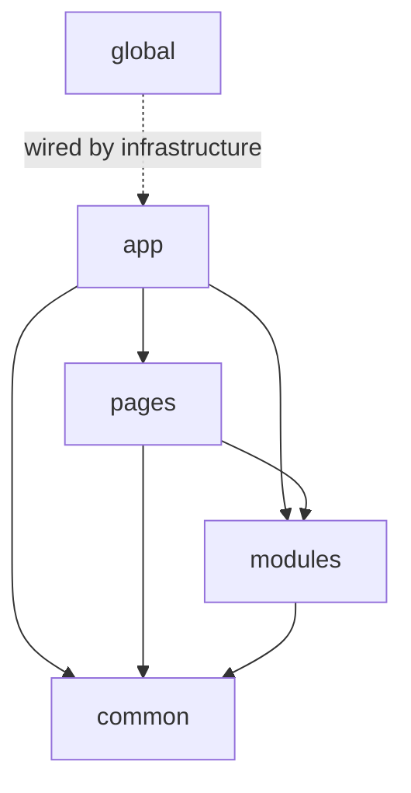

# FEOD: Frontend Architecture Methodology

FEOD (Fractal Entity Oriented Design) is a methodology for organizing frontend applications around modules, a `public API`, fractal structure, and controlled dependencies.



FEOD is useful in projects where ordinary folder-based organization stops protecting boundaries. Code starts leaking between areas, bypass imports appear, `common` turns into a dumping ground, and the project structure survives only as tribal knowledge in the team's heads.

FEOD introduces a simple frame for this:

- every top-level level has a clear role;
- a module exposes only its `public API`;
- dependencies between levels are constrained;
- the same organizational logic repeats at different scales, from the whole project down to a single module.

## What Problem FEOD Solves

Without explicit boundaries, frontend projects usually degrade in the same way:

- pages start importing implementation details from other features directly;
- shared utilities and components accumulate in `common` without clear criteria;
- a module's internal structure becomes part of its external contract;
- every change requires knowing too much about neighboring code.

FEOD makes the structure readable and verifiable. The code should make it clear:

- where the application entry point is;
- what counts as a page;
- what counts as a module;
- what can be reused globally;
- which `public API` is the allowed way to consume a module.

## How FEOD Differs from Regular Modular Architecture

Regular modular architecture often stops at the idea of "split the project into modules." After that, each team decides for itself:

- what should count as a module;
- where a module boundary is drawn;
- whether importing a neighbor's internals is allowed;
- where shared code should live;
- how to keep the same structure inside modules themselves.

FEOD answers these questions up front:

- the top-level levels are fixed: `app`, `pages`, `modules`, `common`, `global`;
- external access to a module goes through `index.ts` as its `public API`;
- deep imports into another module's internals are treated as violations;
- the structure is fractal: large project areas and nested areas follow the same principles.

In other words, FEOD is not just the idea of splitting code into pieces. It is a set of rules that keeps those pieces independent.

## How FEOD Differs from FSD

FEOD and FSD solve a similar problem: making frontend architecture understandable and resilient. FEOD describes it through the `app`, `pages`, `modules`, `common`, and `global` levels, and makes the module the primary building block.

The practical difference is usually this:

- in FEOD, the primary term is **level**, not layer;
- FEOD does not require a fixed set of FSD layers such as `entities`, `features`, and `widgets`;
- FEOD focuses on the module, its `public API`, and dependency boundaries;
- FEOD is easier to apply in projects that do not need a deep taxonomy of domain types, but do need strict import rules and a scalable structure.

If you know FSD, you can think of FEOD as a more direct frame around modules and levels. But FEOD is a separate methodology, not a renaming of FSD terms.

## Top-Level FEOD Levels

At the project root, FEOD uses only five names:

```text
src/
  app/
  pages/
  modules/
  common/
  global/
```

- `app` - application startup, routing, providers, and top-level composition.
- `pages` - pages and large entry scenarios.
- `modules` - self-contained modules with their own `public API`.
- `common` - reusable FEOD entities that are not tied to a specific module.
- `global` - environment declarations, shims, polyfills, and rare side-effect imports that affect the whole application.

These levels give the project a minimal map. From there, the important part is not memorizing definitions, but using them consistently.

## Where to Go Next

If you are new to FEOD, continue in this order:

1. [Quick Start](./quick-start.md) - the minimal project frame and import rules.
2. [Levels](../core-concepts/levels.md) and the Structure pages for [App](../structure/app.md), [Pages](../structure/pages.md), [Modules](../structure/modules.md), [Common](../structure/common.md), and [Global](../structure/global.md) - to lock in the role of each level.
3. [Import Matrix](../reference/import-matrix.md), [Public API](../reference/public-api.md), and [Code Smells](../reference/code-smells.md) - to avoid blurring boundaries in a real project.

That is enough to understand the basic FEOD model in about 10 minutes and start placing code without mixing philosophy with reference rules.

## Related Pages

- [Quick Start](./quick-start.md)
- [Levels](../core-concepts/levels.md)
- [Import Matrix](../reference/import-matrix.md)
- [Glossary](../reference/glossary.md)
