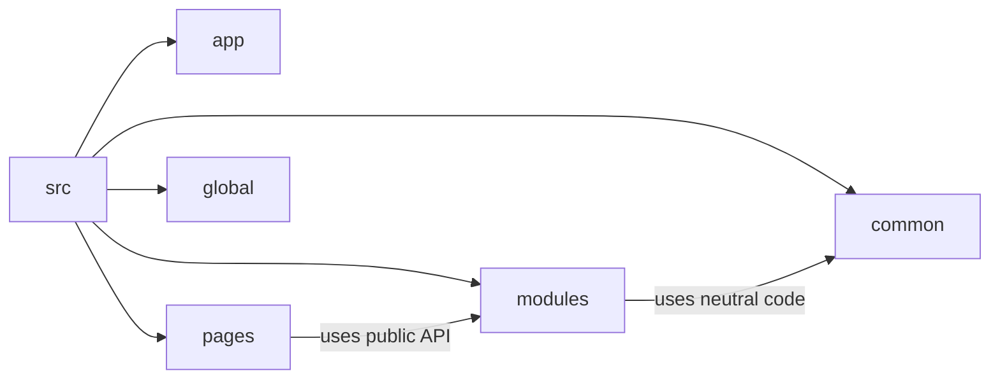

# Quick Start

Below is a minimal FEOD structure for a new frontend project. It does not cover every possible case, but it gives you a working frame you can rely on from day one.



## Minimal Structure

```text
src/
  app/
    providers/
    router/
    index.ts
  pages/
    home/
      ui/
        home-page.tsx
      index.ts
  modules/
    header/
      ui/
        header.tsx
      model/
        use-header-state.ts
      index.ts
  common/
    ui/
      button/
        button.tsx
        index.ts
  global/
    styles/
      index.css
```

Minimal responsibilities of the levels:

- `app` composes the application and knows about routes, providers, and initialization.
- `pages` describes pages and may connect modules.
- `modules` contains self-contained parts of the application with their own `public API`.
- `common` contains reusable FEOD entities that are not tied to one module.
- `global` contains truly global artifacts.

## Page Example

```tsx
// src/pages/home/ui/home-page.tsx
import { Header } from '@/modules/header';

export function HomePage() {
  return (
    <main>
      <Header />
      <h1>Home</h1>
    </main>
  );
}
```

```ts
// src/pages/home/index.ts
export { HomePage } from './ui/home-page';
```

The page depends on the module through its `public API`, not through internal files.

## Module Example

```tsx
// src/modules/header/ui/header.tsx
import { useHeaderState } from '../model/use-header-state';

export function Header() {
  const { title } = useHeaderState();

  return <header>{title}</header>;
}
```

```ts
// src/modules/header/model/use-header-state.ts
export function useHeaderState() {
  return {
    title: 'FEOD Docs',
  };
}
```

```ts
// src/modules/header/index.ts
export { Header } from './ui/header';
```

`index.ts` is the module's `public API`. Everything that external code is allowed to use must be exported here explicitly.

## Good / Bad: public API

Good:

```ts
import { Header } from '@/modules/header';
```

Bad:

```ts
import { Header } from '@/modules/header/ui/header';
```

Why it is bad: external code starts depending on the module's internal structure. Moving a file becomes a breaking change.

## Good / Bad: Allowed Import and Deep Import

Good:

```ts
// src/pages/home/ui/home-page.tsx
import { Button } from '@/common/ui/button';
import { Header } from '@/modules/header';
```

Bad:

```ts
// src/pages/home/ui/home-page.tsx
import { useHeaderState } from '@/modules/header/model/use-header-state';
```

Why it is bad: the page bypasses another module's `public API` and starts knowing its internal details.

## What to Do Next

After this frame, three next steps are usually enough:

1. Check external import rules against [Public API](../reference/public-api.md).
2. Vet shared-code candidates with the guide [How Not to Turn common into a Dumping Ground](../guides/common-boundaries.md).
3. Evaluate every new folder with the guide [Where to Place Code](../guides/where-to-place-code.md).

## Short Checklist

- The project has the `app`, `pages`, `modules`, `common`, and `global` levels.
- Each module has an `index.ts` with an explicit `public API`.
- Pages import modules through `@/modules/<name>`, not through internal files.
- `common` is not used as a "we will sort it out later" folder.
- `global` does not replace module-level or page-level code.

If these points hold, the project already has a basic FEOD frame that can support stricter rules over time.

## Related Pages

- [Overview](./overview.md)
- [Levels](../core-concepts/levels.md)
- [Import Matrix](../reference/import-matrix.md)
- [Public API](../reference/public-api.md)
- [Where to Place Code](../guides/where-to-place-code.md)
